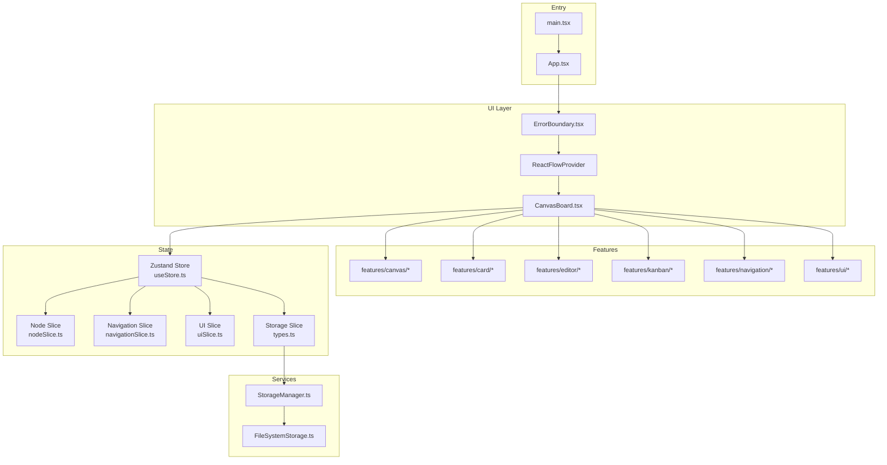
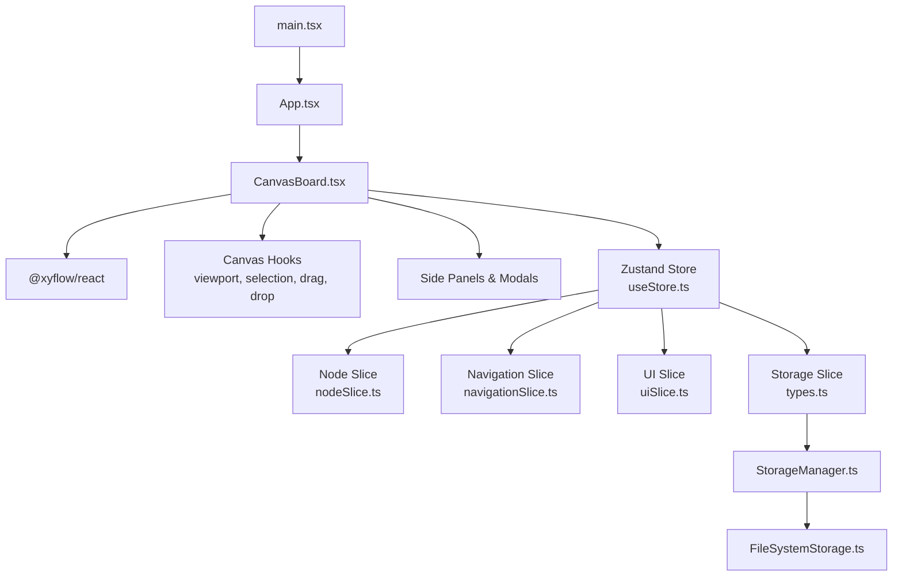
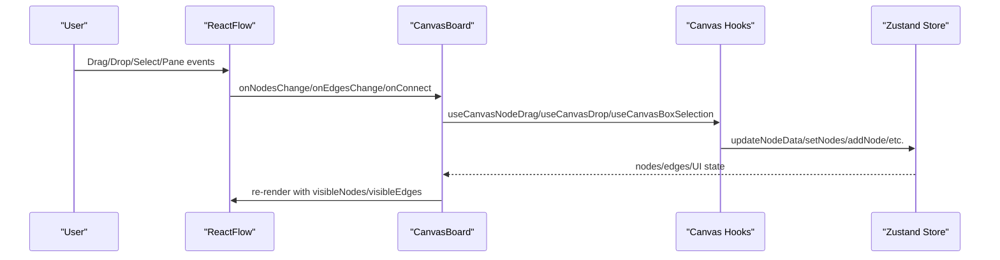
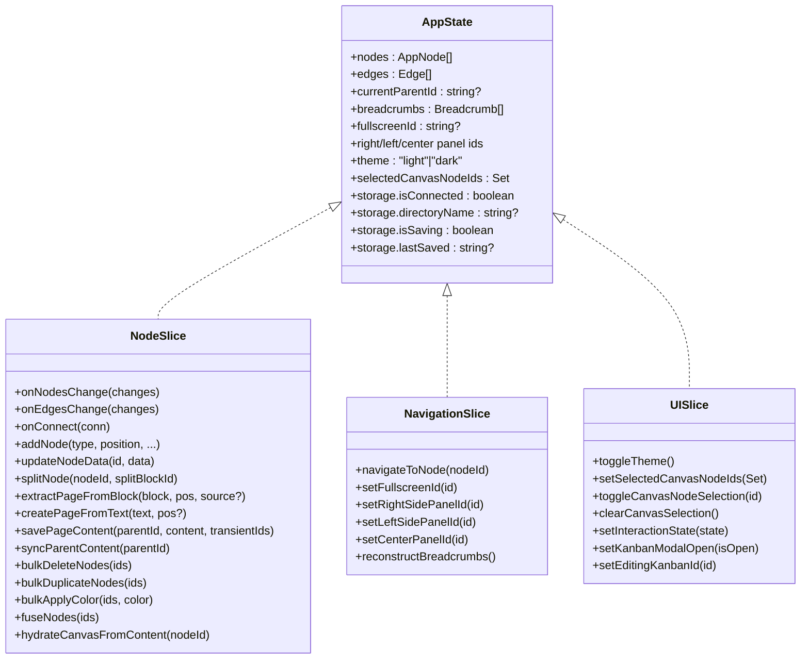
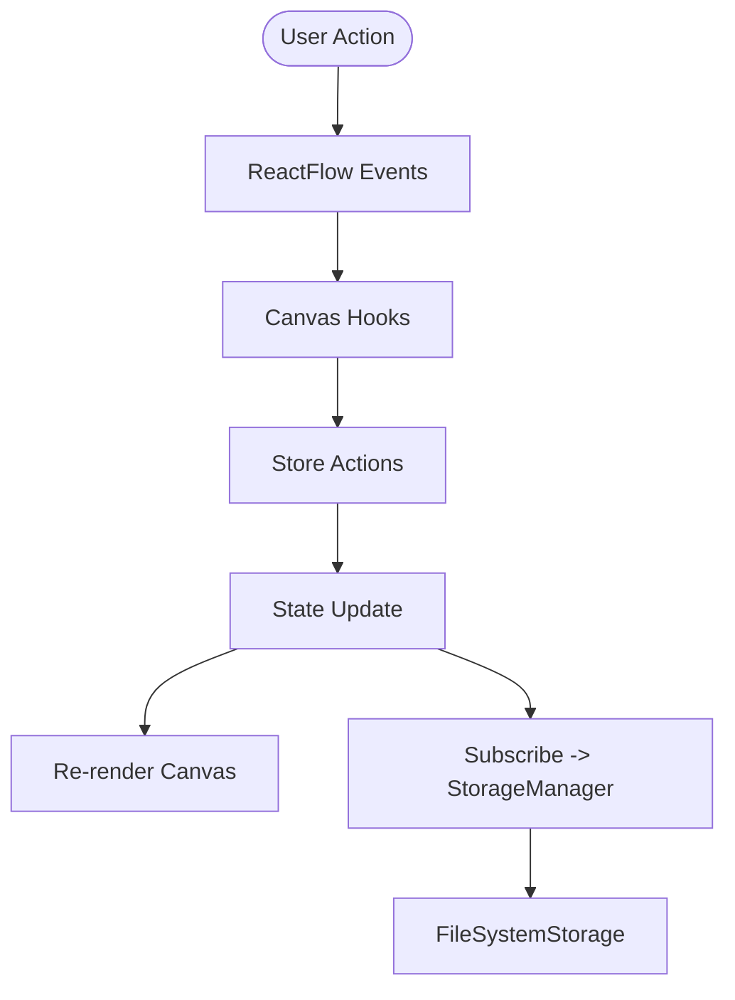
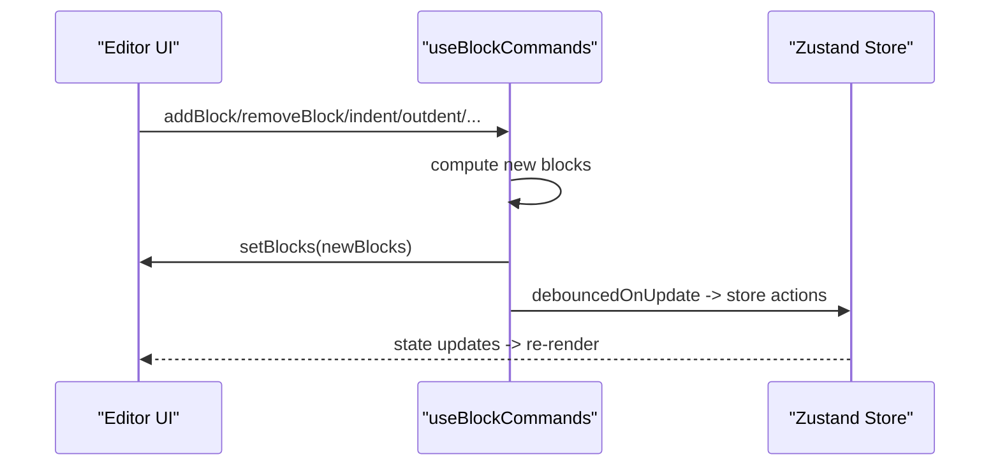
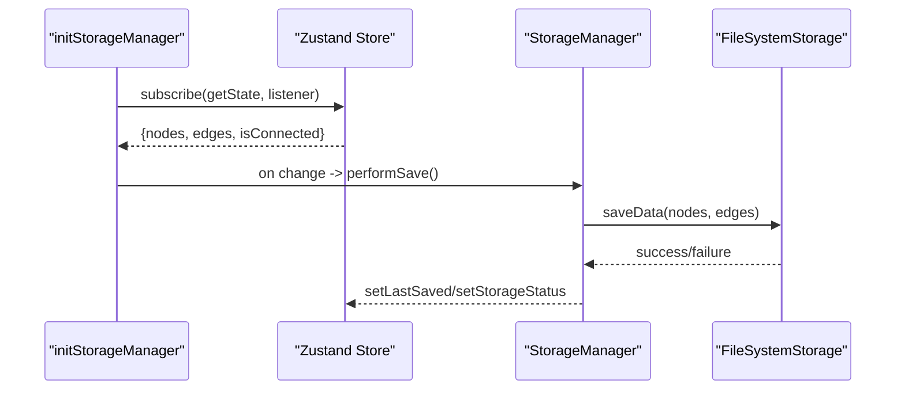
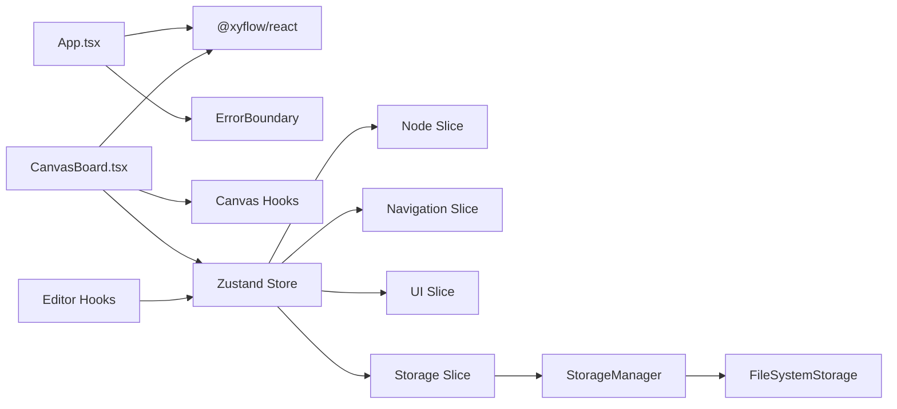

# Architecture Overview

<cite>
**Referenced Files in This Document**
- [App.tsx](file://src/App.tsx)
- [main.tsx](file://src/main.tsx)
- [CanvasBoard.tsx](file://src/features/canvas/CanvasBoard.tsx)
- [useStore.ts](file://src/store/useStore.ts)
- [nodeSlice.ts](file://src/store/slices/nodeSlice.ts)
- [navigationSlice.ts](file://src/store/slices/navigationSlice.ts)
- [uiSlice.ts](file://src/store/slices/uiSlice.ts)
- [types.ts](file://src/store/types.ts)
- [types.ts](file://src/types.ts)
- [StorageManager.ts](file://src/services/StorageManager.ts)
- [FileSystemStorage.ts](file://src/services/FileSystemStorage.ts)
- [ErrorBoundary.tsx](file://src/components/ErrorBoundary.tsx)
- [package.json](file://package.json)
</cite>

## Table of Contents
1. [Introduction](#introduction)
2. [Project Structure](#project-structure)
3. [Core Components](#core-components)
4. [Architecture Overview](#architecture-overview)
5. [Detailed Component Analysis](#detailed-component-analysis)
6. [Dependency Analysis](#dependency-analysis)
7. [Performance Considerations](#performance-considerations)
8. [Troubleshooting Guide](#troubleshooting-guide)
9. [Conclusion](#conclusion)

## Introduction
This document describes the high-level architecture of Infonote, a React-based note-taking application with an infinite canvas. The system emphasizes:
- Feature-based component organization
- Centralized state management via Zustand
- ReactFlow-powered canvas rendering with a Provider pattern for context
- Shared functionality through React hooks
- Integration with external libraries for drag-and-drop and canvas interactions
- Persistent storage via a module-level storage manager

## Project Structure
The project follows a feature-based organization with clear separation of concerns:
- Entry points: main.tsx and App.tsx bootstrap the app and wrap the canvas board with ReactFlow provider and error boundary
- Features: canvas, notes, editors, kanban, navigation, and UI panels
- Store: Zustand-based slices for nodes, navigation, UI, and storage
- Services: storage manager coordinating persistence
- Utilities: types and helpers

**Diagram sources**
- [main.tsx:1-22](file://src/main.tsx#L1-L22)
- [App.tsx:1-16](file://src/App.tsx#L1-L16)
- [CanvasBoard.tsx:1-263](file://src/features/canvas/CanvasBoard.tsx#L1-L263)
- [useStore.ts:1-53](file://src/store/useStore.ts#L1-L53)
- [nodeSlice.ts:1-872](file://src/store/slices/nodeSlice.ts#L1-L872)
- [navigationSlice.ts:1-92](file://src/store/slices/navigationSlice.ts#L1-L92)
- [uiSlice.ts:1-54](file://src/store/slices/uiSlice.ts#L1-L54)
- [types.ts:1-91](file://src/store/types.ts#L1-L91)
- [StorageManager.ts:1-159](file://src/services/StorageManager.ts#L1-L159)
- [FileSystemStorage.ts](file://src/services/FileSystemStorage.ts)

**Section sources**
- [main.tsx:1-22](file://src/main.tsx#L1-L22)
- [App.tsx:1-16](file://src/App.tsx#L1-L16)

## Core Components
- App.tsx: Root component that wraps the UI with an error boundary and provides ReactFlow context
- CanvasBoard.tsx: Top-level canvas renderer integrating ReactFlow, node types, overlays, and side panels
- Zustand Store: Single source of truth composed of multiple slices (nodes, navigation, UI, storage)
- StorageManager: Module-level orchestrator for connecting to persistent storage and auto-saving
- ErrorBoundary: Global error handling around the app

Key architectural patterns:
- Provider pattern: ReactFlowProvider encapsulates canvas context
- Factory pattern: Node types registered in CanvasBoard for dynamic rendering
- Hook pattern: Reusable canvas and editor behaviors extracted into composable hooks

**Section sources**
- [App.tsx:5-13](file://src/App.tsx#L5-L13)
- [CanvasBoard.tsx:98-104](file://src/features/canvas/CanvasBoard.tsx#L98-L104)
- [useStore.ts:11-29](file://src/store/useStore.ts#L11-L29)
- [StorageManager.ts:19-74](file://src/services/StorageManager.ts#L19-L74)
- [ErrorBoundary.tsx:14-56](file://src/components/ErrorBoundary.tsx#L14-L56)

## Architecture Overview
The system is a layered React application:
- Rendering layer: ReactFlow renders nodes and edges; overlays and menus augment interactivity
- State layer: Zustand manages graph state, UI state, navigation breadcrumbs, and storage status
- Persistence layer: StorageManager coordinates connection to a file system directory and auto-save
- Feature layer: Specialized components for notes, kanban, editor, and UI panels

**Diagram sources**
- [CanvasBoard.tsx:183-236](file://src/features/canvas/CanvasBoard.tsx#L183-L236)
- [useStore.ts:11-29](file://src/store/useStore.ts#L11-L29)
- [nodeSlice.ts:93-192](file://src/store/slices/nodeSlice.ts#L93-L192)
- [navigationSlice.ts:4-45](file://src/store/slices/navigationSlice.ts#L4-L45)
- [uiSlice.ts:4-53](file://src/store/slices/uiSlice.ts#L4-L53)
- [types.ts:14-90](file://src/store/types.ts#L14-L90)
- [StorageManager.ts:19-74](file://src/services/StorageManager.ts#L19-L74)
- [FileSystemStorage.ts](file://src/services/FileSystemStorage.ts)
- [App.tsx:5-13](file://src/App.tsx#L5-L13)
- [main.tsx:15-21](file://src/main.tsx#L15-L21)

## Detailed Component Analysis

### Canvas Rendering and Interaction
CanvasBoard integrates ReactFlow with custom node types and overlays. It:
- Registers node types (note, block, fused-note, kanban)
- Computes visible nodes and edges for viewport-aware rendering
- Provides drag, drop, selection, and viewport handlers via hooks
- Manages side panels, modals, and slash menus

**Diagram sources**
- [CanvasBoard.tsx:183-236](file://src/features/canvas/CanvasBoard.tsx#L183-L236)
- [CanvasBoard.tsx:113-147](file://src/features/canvas/CanvasBoard.tsx#L113-L147)
- [nodeSlice.ts:97-192](file://src/store/slices/nodeSlice.ts#L97-L192)

**Section sources**
- [CanvasBoard.tsx:98-104](file://src/features/canvas/CanvasBoard.tsx#L98-L104)
- [CanvasBoard.tsx:113-147](file://src/features/canvas/CanvasBoard.tsx#L113-L147)
- [CanvasBoard.tsx:183-236](file://src/features/canvas/CanvasBoard.tsx#L183-L236)

### State Management Architecture
Zustand composes multiple slices into a single store:
- Node slice: manages nodes, edges, creation, updates, splitting, fusing, hydration, and parent-content synchronization
- Navigation slice: tracks current parent, breadcrumbs, and side panel visibility
- UI slice: theme, selection, interaction state, and modal toggles
- Storage slice: connection status, saving state, and last saved timestamp

**Diagram sources**
- [types.ts:14-90](file://src/store/types.ts#L14-L90)
- [nodeSlice.ts:93-872](file://src/store/slices/nodeSlice.ts#L93-L872)
- [navigationSlice.ts:4-91](file://src/store/slices/navigationSlice.ts#L4-L91)
- [uiSlice.ts:4-53](file://src/store/slices/uiSlice.ts#L4-L53)

**Section sources**
- [useStore.ts:11-29](file://src/store/useStore.ts#L11-L29)
- [types.ts:14-90](file://src/store/types.ts#L14-L90)
- [nodeSlice.ts:93-192](file://src/store/slices/nodeSlice.ts#L93-L192)
- [navigationSlice.ts:4-45](file://src/store/slices/navigationSlice.ts#L4-L45)
- [uiSlice.ts:4-53](file://src/store/slices/uiSlice.ts#L4-L53)

### Data Flow Patterns
- Event-driven updates: ReactFlow emits change events; CanvasBoard delegates to hooks; hooks call store actions; store updates state and triggers re-renders
- Parent-child synchronization: Changes in a note’s content propagate to related fused/block nodes and vice versa
- Hydration: Navigating into a note hydrates the canvas from stored content blocks
- Debounced autosave: Store subscriptions trigger StorageManager to persist changes

**Diagram sources**
- [CanvasBoard.tsx:183-236](file://src/features/canvas/CanvasBoard.tsx#L183-L236)
- [nodeSlice.ts:237-330](file://src/store/slices/nodeSlice.ts#L237-L330)
- [StorageManager.ts:44-73](file://src/services/StorageManager.ts#L44-L73)

**Section sources**
- [nodeSlice.ts:237-330](file://src/store/slices/nodeSlice.ts#L237-L330)
- [StorageManager.ts:44-73](file://src/services/StorageManager.ts#L44-L73)

### Editor Hooks Pattern
The editor uses a hook-based command system to manage block-level operations:
- Composition: useBlockCommands encapsulates add/remove/indent/outdent, turn-into, color, duplicate/delete, split, paste, and keyboard shortcuts
- Delegation: commands update local block arrays and delegate persistence via debounced callbacks
- Integration: relies on the central store for cross-node synchronization and persistence

**Diagram sources**
- [useBlockCommands.ts:19-333](file://src/features/editor/hooks/useBlockCommands.ts#L19-L333)
- [nodeSlice.ts:237-330](file://src/store/slices/nodeSlice.ts#L237-L330)

**Section sources**
- [useBlockCommands.ts:19-333](file://src/features/editor/hooks/useBlockCommands.ts#L19-L333)

### Storage Integration
StorageManager initializes once and subscribes to store changes:
- Initialization: connects to a file system directory, loads persisted data if available, and sets status
- Auto-save: debounces saves for content changes and performs immediate saves for structural changes
- Callbacks: notifies UI about connection status, saving state, and last saved time

**Diagram sources**
- [useStore.ts:31-52](file://src/store/useStore.ts#L31-L52)
- [StorageManager.ts:19-74](file://src/services/StorageManager.ts#L19-L74)
- [StorageManager.ts:96-109](file://src/services/StorageManager.ts#L96-L109)

**Section sources**
- [useStore.ts:31-52](file://src/store/useStore.ts#L31-L52)
- [StorageManager.ts:19-74](file://src/services/StorageManager.ts#L19-L74)
- [StorageManager.ts:96-109](file://src/services/StorageManager.ts#L96-L109)

## Dependency Analysis
External dependencies shaping the architecture:
- @xyflow/react: Canvas rendering and node/edge lifecycle
- @dnd-kit/*: Drag-and-drop interactions integrated via hooks
- zustand: Centralized state with middleware for subscriptions and temporal history
- react-pdf/pdfjs-dist: PDF viewing support
- lucide-react: Icons
- motion: Animations
- react-window: Virtualization for large lists
- uuid: Unique identifiers
- lz-string: Compression utilities

**Diagram sources**
- [App.tsx:1-13](file://src/App.tsx#L1-L13)
- [CanvasBoard.tsx:1-37](file://src/features/canvas/CanvasBoard.tsx#L1-L37)
- [useStore.ts:11-29](file://src/store/useStore.ts#L11-L29)
- [StorageManager.ts:19-74](file://src/services/StorageManager.ts#L19-L74)
- [package.json:12-32](file://package.json#L12-L32)

**Section sources**
- [package.json:12-32](file://package.json#L12-L32)

## Performance Considerations
- Virtualization: Large block lists are handled efficiently via virtualized rendering
- Viewport culling: Only visible nodes and edges are rendered to reduce DOM overhead
- Debounced autosave: Content changes are debounced; structural changes save immediately
- Temporal history: Zustand temporal middleware limits history size and partializes snapshots to nodes and edges
- Lazy loading: Some modals are lazy-loaded to reduce initial bundle size

[No sources needed since this section provides general guidance]

## Troubleshooting Guide
- Error boundary: Catches rendering errors and offers a reload option
- Storage connectivity: On save failure, status is reset; reconnect attempts occur on startup
- Parent-child sync loops: Bidirectional sync is gated to prevent loops when editing inside vs. outside the child canvas

**Section sources**
- [ErrorBoundary.tsx:14-56](file://src/components/ErrorBoundary.tsx#L14-L56)
- [StorageManager.ts:76-94](file://src/services/StorageManager.ts#L76-L94)
- [nodeSlice.ts:251-300](file://src/store/slices/nodeSlice.ts#L251-L300)

## Conclusion
Infonote’s architecture combines a feature-based React structure with a centralized Zustand store and a robust persistence layer. The Provider pattern with ReactFlow, Factory-style node registration, and Hook-based composability deliver a scalable and maintainable system for an infinite canvas note-taking application.