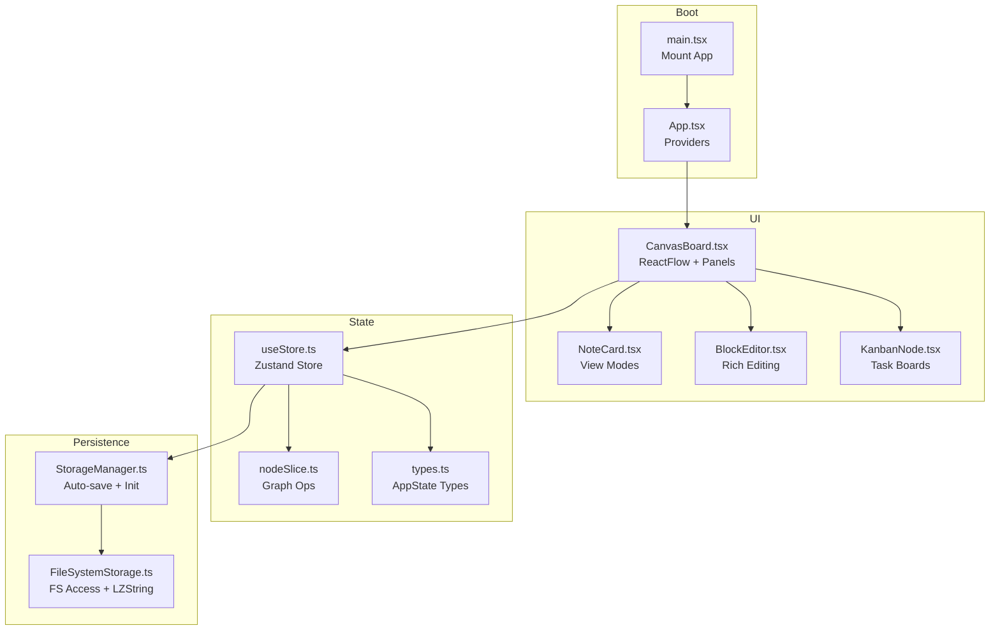
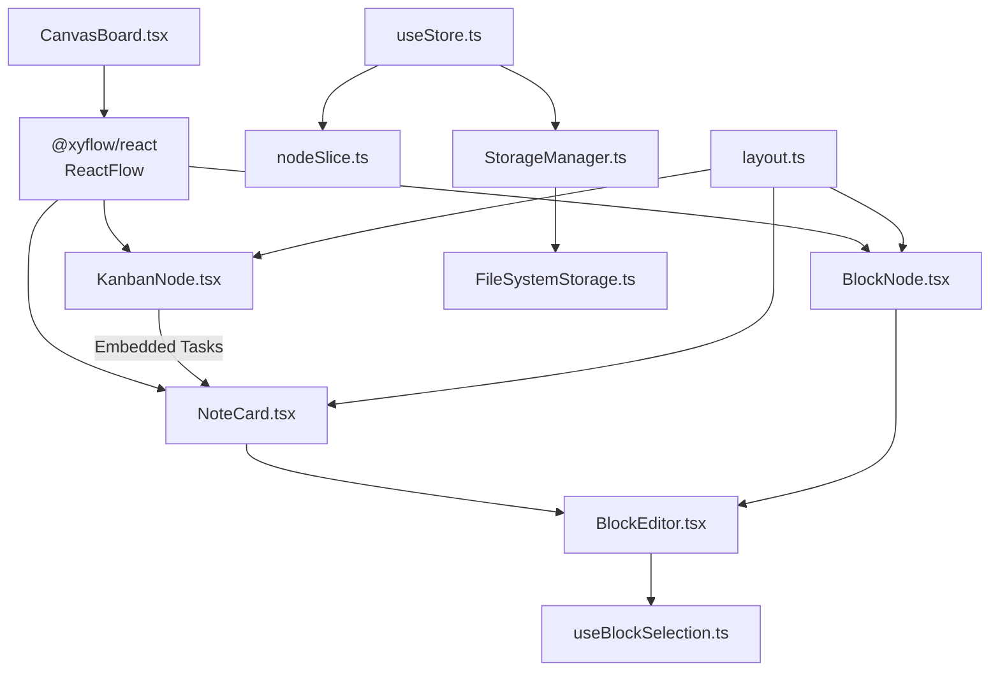
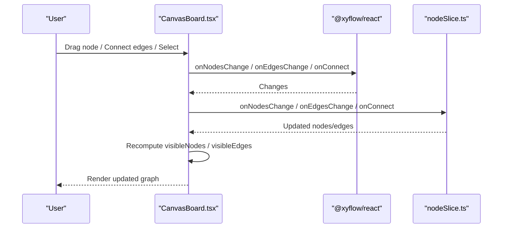
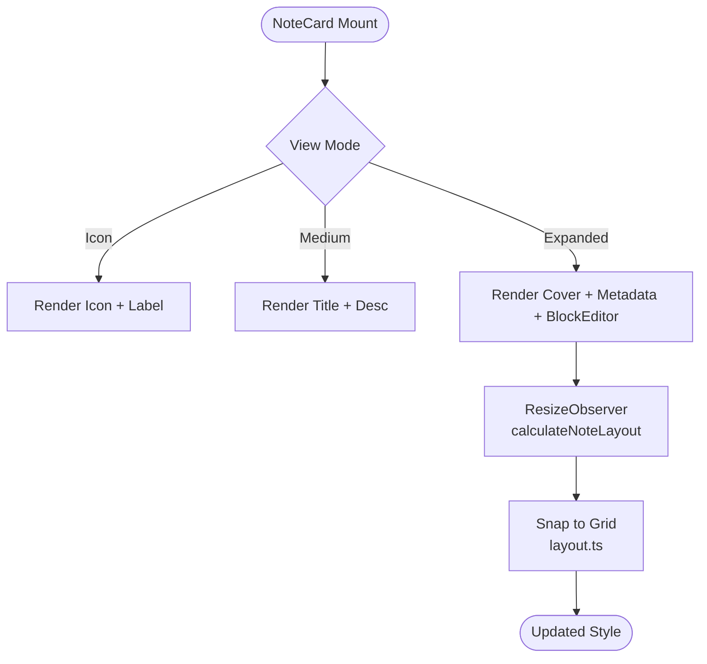
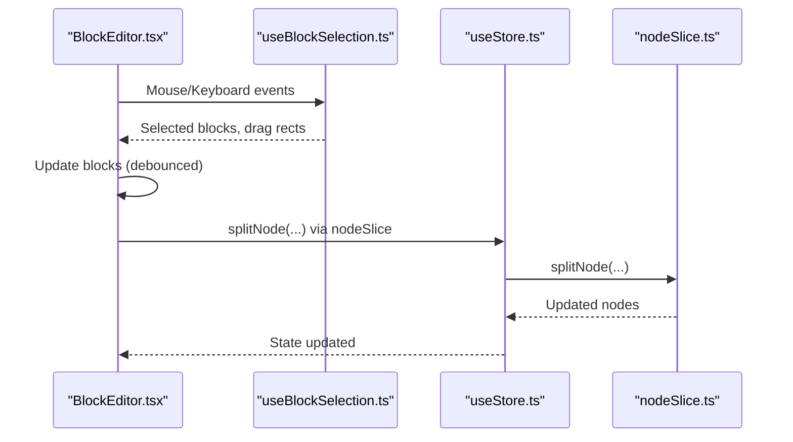
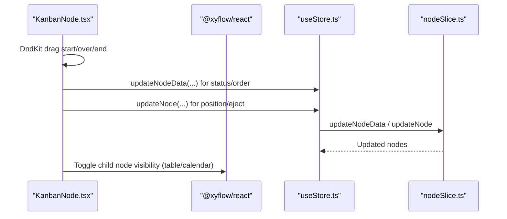
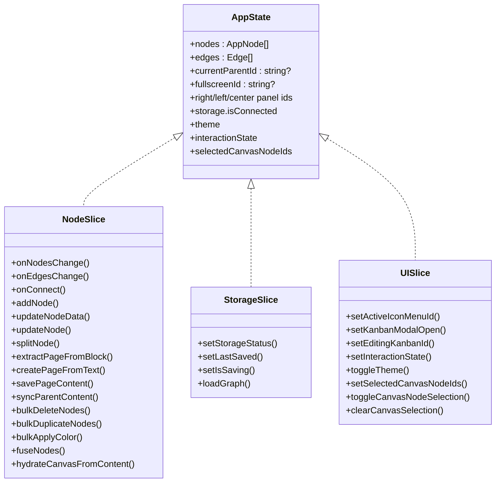
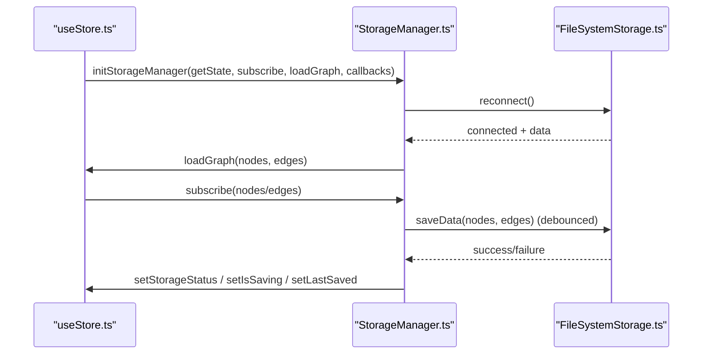
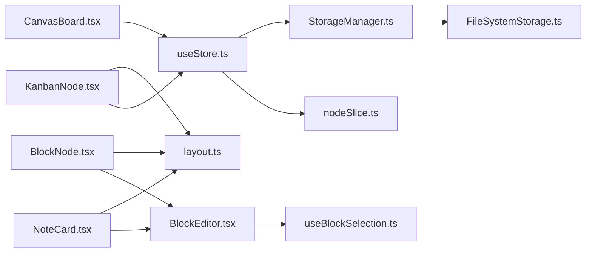

# Core Systems

<cite>
**Referenced Files in This Document**
- [App.tsx](file://src/App.tsx)
- [main.tsx](file://src/main.tsx)
- [CanvasBoard.tsx](file://src/features/canvas/CanvasBoard.tsx)
- [useStore.ts](file://src/store/useStore.ts)
- [types.ts](file://src/store/types.ts)
- [nodeSlice.ts](file://src/store/slices/nodeSlice.ts)
- [StorageManager.ts](file://src/services/StorageManager.ts)
- [FileSystemStorage.ts](file://src/services/FileSystemStorage.ts)
- [BlockEditor.tsx](file://src/features/editor/BlockEditor.tsx)
- [BlockNode.tsx](file://src/features/block/BlockNode.tsx)
- [NoteCard.tsx](file://src/features/card/NoteCard.tsx)
- [KanbanNode.tsx](file://src/features/kanban/KanbanNode.tsx)
- [layout.ts](file://src/config/layout.ts)
- [useBlockSelection.ts](file://src/features/editor/hooks/useBlockSelection.ts)
</cite>

## Table of Contents
1. [Introduction](#introduction)
2. [Project Structure](#project-structure)
3. [Core Components](#core-components)
4. [Architecture Overview](#architecture-overview)
5. [Detailed Component Analysis](#detailed-component-analysis)
6. [Dependency Analysis](#dependency-analysis)
7. [Performance Considerations](#performance-considerations)
8. [Troubleshooting Guide](#troubleshooting-guide)
9. [Conclusion](#conclusion)

## Introduction
This document explains Infonote’s core systems and how they work together to deliver an infinite canvas, rich note editing, task management, and persistent storage. The systems covered include:
- Canvas System: Infinite spatial organization powered by a graph of nodes and edges
- Note Management System: Multiple view modes (icon, medium, expanded) and metadata editing
- Block Editor System: Rich content editing with commands, selection, and drag-and-drop
- Kanban Integration: Task boards with drag-and-drop, filters, sorting, and multiple views
- State Management with Zustand: Centralized store with slices for nodes, navigation, UI, and storage
- Storage System: File System Access API-backed persistence with auto-save and recovery

These systems integrate tightly: the Canvas renders nodes and edges, the Block Editor edits per-node content, Kanban nodes embed task lists, and Zustand coordinates state and persistence.

## Project Structure
At a high level, the app bootstraps with a provider wrapper around the main board, which orchestrates the canvas, panels, and modals. The store composes multiple slices and initializes the storage manager to synchronize with the file system.

**Diagram sources**
- [main.tsx:1-22](file://src/main.tsx#L1-L22)
- [App.tsx:1-16](file://src/App.tsx#L1-L16)
- [CanvasBoard.tsx:1-263](file://src/features/canvas/CanvasBoard.tsx#L1-L263)
- [useStore.ts:1-53](file://src/store/useStore.ts#L1-L53)
- [nodeSlice.ts:1-800](file://src/store/slices/nodeSlice.ts#L1-L800)
- [StorageManager.ts:1-159](file://src/services/StorageManager.ts#L1-L159)
- [FileSystemStorage.ts:1-536](file://src/services/FileSystemStorage.ts#L1-L536)

**Section sources**
- [main.tsx:1-22](file://src/main.tsx#L1-L22)
- [App.tsx:1-16](file://src/App.tsx#L1-L16)
- [CanvasBoard.tsx:1-263](file://src/features/canvas/CanvasBoard.tsx#L1-L263)
- [useStore.ts:1-53](file://src/store/useStore.ts#L1-L53)
- [types.ts:1-91](file://src/store/types.ts#L1-L91)
- [StorageManager.ts:1-159](file://src/services/StorageManager.ts#L1-L159)
- [FileSystemStorage.ts:1-536](file://src/services/FileSystemStorage.ts#L1-L536)

## Core Components
- Canvas System: Renders nodes (notes, blocks, fused notes, kanban) with edges, supports drag-and-drop, selection, and viewport culling. It integrates with hooks for viewport, drag, drop, and selection.
- Note Management System: Provides three view modes (icon, medium, expanded) with metadata editing, auto-resize, and dynamic layouts. Supports nested/fused content and page extraction.
- Block Editor System: Rich text editing with slash commands, keyboard shortcuts, selection, drag-and-drop, and floating toolbar. Integrates with the store for splitting and syncing content.
- Kanban Integration: A specialized node type with multiple views (board, table, calendar, timeline), filters, sorting, swimlanes, and drag-to-eject behavior into the canvas.
- State Management with Zustand: Central store composed of slices for nodes, navigation, UI, and storage. Includes temporal history and subscription-based auto-save.
- Storage System: Uses the File System Access API to persist nodes and edges as JSON, with compression, backups, and recovery. Initializes automatically and subscribes to store changes.

**Section sources**
- [CanvasBoard.tsx:1-263](file://src/features/canvas/CanvasBoard.tsx#L1-L263)
- [NoteCard.tsx:1-619](file://src/features/card/NoteCard.tsx#L1-L619)
- [BlockEditor.tsx:1-819](file://src/features/editor/BlockEditor.tsx#L1-L819)
- [KanbanNode.tsx:1-738](file://src/features/kanban/KanbanNode.tsx#L1-L738)
- [useStore.ts:1-53](file://src/store/useStore.ts#L1-L53)
- [nodeSlice.ts:1-800](file://src/store/slices/nodeSlice.ts#L1-L800)
- [StorageManager.ts:1-159](file://src/services/StorageManager.ts#L1-L159)
- [FileSystemStorage.ts:1-536](file://src/services/FileSystemStorage.ts#L1-L536)

## Architecture Overview
The architecture centers on a graph model (nodes and edges) rendered by React Flow, with content managed per node. The store orchestrates state transitions, and the storage layer persists changes to the file system.

**Diagram sources**
- [CanvasBoard.tsx:1-263](file://src/features/canvas/CanvasBoard.tsx#L1-L263)
- [NoteCard.tsx:1-619](file://src/features/card/NoteCard.tsx#L1-L619)
- [BlockNode.tsx:1-129](file://src/features/block/BlockNode.tsx#L1-L129)
- [KanbanNode.tsx:1-738](file://src/features/kanban/KanbanNode.tsx#L1-L738)
- [BlockEditor.tsx:1-819](file://src/features/editor/BlockEditor.tsx#L1-L819)
- [useStore.ts:1-53](file://src/store/useStore.ts#L1-L53)
- [nodeSlice.ts:1-800](file://src/store/slices/nodeSlice.ts#L1-L800)
- [StorageManager.ts:1-159](file://src/services/StorageManager.ts#L1-L159)
- [FileSystemStorage.ts:1-536](file://src/services/FileSystemStorage.ts#L1-L536)
- [layout.ts:1-138](file://src/config/layout.ts#L1-L138)
- [useBlockSelection.ts:1-289](file://src/features/editor/hooks/useBlockSelection.ts#L1-L289)

## Detailed Component Analysis

### Canvas System
The Canvas renders a graph of nodes and edges, with:
- Node types registered (note, block, fused-note, kanban)
- Viewport culling to visible nodes
- Drag-and-drop, selection, and connection handling
- Theme and overlay controls

**Diagram sources**
- [CanvasBoard.tsx:183-236](file://src/features/canvas/CanvasBoard.tsx#L183-L236)
- [nodeSlice.ts:93-192](file://src/store/slices/nodeSlice.ts#L93-L192)

**Section sources**
- [CanvasBoard.tsx:1-263](file://src/features/canvas/CanvasBoard.tsx#L1-L263)
- [nodeSlice.ts:1-800](file://src/store/slices/nodeSlice.ts#L1-L800)

### Note Management System
Notes support three view modes with dynamic sizing and metadata editing:
- Icon mode: compact representation
- Medium mode: title and description
- Expanded mode: cover, metadata, and embedded BlockEditor

**Diagram sources**
- [NoteCard.tsx:52-260](file://src/features/card/NoteCard.tsx#L52-L260)
- [layout.ts:61-100](file://src/config/layout.ts#L61-L100)

**Section sources**
- [NoteCard.tsx:1-619](file://src/features/card/NoteCard.tsx#L1-L619)
- [layout.ts:1-138](file://src/config/layout.ts#L1-L138)

### Block Editor System
The Block Editor provides rich editing with:
- Slash command menu
- Keyboard shortcuts (splitting, indent/outdent, duplication)
- Selection and drag-and-drop
- Debounced updates to the store

**Diagram sources**
- [BlockEditor.tsx:40-196](file://src/features/editor/BlockEditor.tsx#L40-L196)
- [useBlockSelection.ts:1-289](file://src/features/editor/hooks/useBlockSelection.ts#L1-L289)
- [nodeSlice.ts:340-402](file://src/store/slices/nodeSlice.ts#L340-L402)

**Section sources**
- [BlockEditor.tsx:1-819](file://src/features/editor/BlockEditor.tsx#L1-L819)
- [useBlockSelection.ts:1-289](file://src/features/editor/hooks/useBlockSelection.ts#L1-L289)
- [nodeSlice.ts:1-800](file://src/store/slices/nodeSlice.ts#L1-L800)

### Kanban Integration
Kanban nodes embed task lists with:
- Multiple views (board, table, calendar, timeline)
- Filters, sorting, swimlanes
- Drag-and-drop with eject-to-canvas behavior

**Diagram sources**
- [KanbanNode.tsx:47-592](file://src/features/kanban/KanbanNode.tsx#L47-L592)
- [nodeSlice.ts:237-330](file://src/store/slices/nodeSlice.ts#L237-L330)

**Section sources**
- [KanbanNode.tsx:1-738](file://src/features/kanban/KanbanNode.tsx#L1-L738)
- [nodeSlice.ts:1-800](file://src/store/slices/nodeSlice.ts#L1-L800)

### State Management with Zustand
The store composes multiple slices and enables temporal history and subscriptions:
- Node slice manages graph mutations and parent-child content sync
- Navigation slice tracks current context and side panels
- UI slice tracks interaction state and selections
- Storage slice exposes persistence status and last saved time

**Diagram sources**
- [types.ts:14-91](file://src/store/types.ts#L14-L91)
- [nodeSlice.ts:93-330](file://src/store/slices/nodeSlice.ts#L93-L330)
- [useStore.ts:11-29](file://src/store/useStore.ts#L11-L29)

**Section sources**
- [useStore.ts:1-53](file://src/store/useStore.ts#L1-L53)
- [types.ts:1-91](file://src/store/types.ts#L1-L91)
- [nodeSlice.ts:1-800](file://src/store/slices/nodeSlice.ts#L1-L800)

### Storage System
The storage system persists nodes and edges to a user-selected folder using the File System Access API:
- Auto-reconnect on load
- Debounced saves for structural vs content changes
- Compression and atomic replacement
- Backup and recovery

**Diagram sources**
- [useStore.ts:31-52](file://src/store/useStore.ts#L31-L52)
- [StorageManager.ts:19-74](file://src/services/StorageManager.ts#L19-L74)
- [FileSystemStorage.ts:138-205](file://src/services/FileSystemStorage.ts#L138-L205)

**Section sources**
- [StorageManager.ts:1-159](file://src/services/StorageManager.ts#L1-L159)
- [FileSystemStorage.ts:1-536](file://src/services/FileSystemStorage.ts#L1-L536)
- [useStore.ts:1-53](file://src/store/useStore.ts#L1-L53)

## Dependency Analysis
The systems depend on each other as follows:
- Canvas depends on Zustand for node/edge state and on hooks for viewport/drag/drop/selection
- Notes and Blocks depend on the Block Editor and layout utilities
- Kanban depends on the store for node updates and on React Flow for rendering
- Store depends on slices for domain logic and on Storage Manager for persistence
- Storage Manager depends on FileSystemStorage for IO and IndexedDB for handle caching

**Diagram sources**
- [CanvasBoard.tsx:1-263](file://src/features/canvas/CanvasBoard.tsx#L1-L263)
- [useStore.ts:1-53](file://src/store/useStore.ts#L1-L53)
- [nodeSlice.ts:1-800](file://src/store/slices/nodeSlice.ts#L1-L800)
- [StorageManager.ts:1-159](file://src/services/StorageManager.ts#L1-L159)
- [FileSystemStorage.ts:1-536](file://src/services/FileSystemStorage.ts#L1-L536)
- [NoteCard.tsx:1-619](file://src/features/card/NoteCard.tsx#L1-L619)
- [BlockNode.tsx:1-129](file://src/features/block/BlockNode.tsx#L1-L129)
- [BlockEditor.tsx:1-819](file://src/features/editor/BlockEditor.tsx#L1-L819)
- [useBlockSelection.ts:1-289](file://src/features/editor/hooks/useBlockSelection.ts#L1-L289)
- [layout.ts:1-138](file://src/config/layout.ts#L1-L138)

**Section sources**
- [CanvasBoard.tsx:1-263](file://src/features/canvas/CanvasBoard.tsx#L1-L263)
- [useStore.ts:1-53](file://src/store/useStore.ts#L1-L53)
- [nodeSlice.ts:1-800](file://src/store/slices/nodeSlice.ts#L1-L800)
- [StorageManager.ts:1-159](file://src/services/StorageManager.ts#L1-L159)
- [FileSystemStorage.ts:1-536](file://src/services/FileSystemStorage.ts#L1-L536)
- [NoteCard.tsx:1-619](file://src/features/card/NoteCard.tsx#L1-L619)
- [BlockNode.tsx:1-129](file://src/features/block/BlockNode.tsx#L1-L129)
- [BlockEditor.tsx:1-819](file://src/features/editor/BlockEditor.tsx#L1-L819)
- [useBlockSelection.ts:1-289](file://src/features/editor/hooks/useBlockSelection.ts#L1-L289)
- [layout.ts:1-138](file://src/config/layout.ts#L1-L138)

## Performance Considerations
- Canvas viewport culling reduces rendering to visible nodes and edges
- Debounced saves minimize IO during rapid edits
- Compression reduces file sizes for large documents
- Throttled selection and resize observers reduce CPU usage
- Temporal history limits memory footprint for undo/redo

[No sources needed since this section provides general guidance]

## Troubleshooting Guide
Common issues and remedies:
- Storage disconnected: The storage manager detects invalid handles and resets status; reconnect via the storage dialog
- Auto-save delays: Structural changes save immediately; content changes debounce to reduce IO
- Selection artifacts: Dedicated drag-clear events and refs ensure clean selection state
- Layout drift: Auto-correction snaps sizes to grid; avoid conflicting manual and automatic resizing

**Section sources**
- [StorageManager.ts:76-109](file://src/services/StorageManager.ts#L76-L109)
- [FileSystemStorage.ts:212-303](file://src/services/FileSystemStorage.ts#L212-L303)
- [BlockEditor.tsx:171-230](file://src/features/editor/BlockEditor.tsx#L171-L230)
- [NoteCard.tsx:200-260](file://src/features/card/NoteCard.tsx#L200-L260)

## Conclusion
Infonote’s core systems form a cohesive architecture: a graph-based canvas renders heterogeneous nodes, each with rich content managed by the Block Editor; Kanban integrates seamlessly as a specialized node type; Zustand coordinates state and persistence; and the storage layer ensures reliable, compressed, and recoverable data. Together, they enable infinite spatial organization, flexible note authoring, and robust task management.