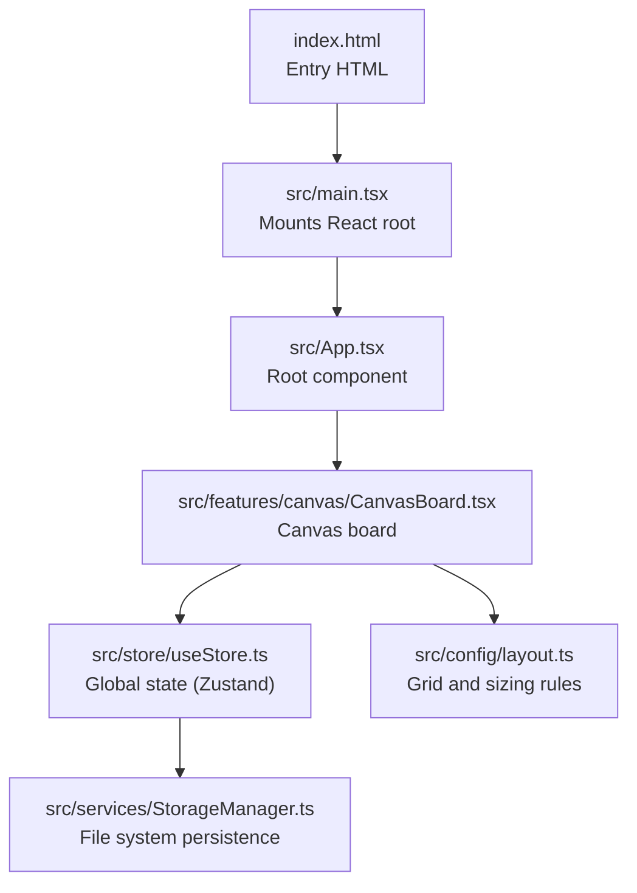
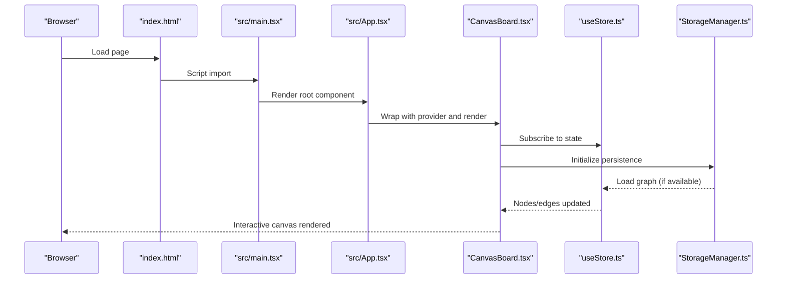

# Getting Started

<cite>
**Referenced Files in This Document**
- [README.md](file://README.md)
- [package.json](file://package.json)
- [vite.config.ts](file://vite.config.ts)
- [index.html](file://index.html)
- [src/main.tsx](file://src/main.tsx)
- [src/App.tsx](file://src/App.tsx)
- [src/features/canvas/CanvasBoard.tsx](file://src/features/canvas/CanvasBoard.tsx)
- [src/store/useStore.ts](file://src/store/useStore.ts)
- [src/services/StorageManager.ts](file://src/services/StorageManager.ts)
- [src/config/layout.ts](file://src/config/layout.ts)
- [INFORMATION_ARCHITECTURE.md](file://INFORMATION_ARCHITECTURE.md)
- [eslint.config.js](file://eslint.config.js)
- [tsconfig.json](file://tsconfig.json)
- [tailwind.config.js](file://tailwind.config.js)
</cite>

## Table of Contents
1. [Introduction](#introduction)
2. [Project Structure](#project-structure)
3. [Core Components](#core-components)
4. [Architecture Overview](#architecture-overview)
5. [Installation and Setup](#installation-and-setup)
6. [Development Workflow](#development-workflow)
7. [First-Time User Tutorial](#first-time-user-tutorial)
8. [Troubleshooting Guide](#troubleshooting-guide)
9. [Conclusion](#conclusion)

## Introduction
Infonote is an infinite canvas note-taking application built with React, TypeScript, and Vite. It lets you organize ideas spatially using interconnected note cards, block-based content editing, and a modern dark theme with glassmorphism. This guide helps you install, run, and start using Infonote quickly.

## Project Structure
At a high level, Infonote follows a feature-based structure:
- src/main.tsx initializes the app and mounts the root component.
- src/App.tsx sets up the canvas provider and renders the main board.
- src/features/canvas/CanvasBoard.tsx orchestrates the infinite canvas, overlays, menus, and panels.
- src/store/useStore.ts defines global state with Zustand and integrates persistence.
- src/services/StorageManager.ts manages file system storage for saving/loading graph data.
- Configuration files include Vite, Tailwind CSS, TypeScript, and ESLint.

**Diagram sources**
- [index.html:1-23](file://index.html#L1-L23)
- [src/main.tsx:1-22](file://src/main.tsx#L1-L22)
- [src/App.tsx:1-16](file://src/App.tsx#L1-L16)
- [src/features/canvas/CanvasBoard.tsx:1-263](file://src/features/canvas/CanvasBoard.tsx#L1-L263)
- [src/store/useStore.ts:1-53](file://src/store/useStore.ts#L1-L53)
- [src/services/StorageManager.ts:1-159](file://src/services/StorageManager.ts#L1-L159)
- [src/config/layout.ts:1-138](file://src/config/layout.ts#L1-L138)

**Section sources**
- [INFORMATION_ARCHITECTURE.md:19-50](file://INFORMATION_ARCHITECTURE.md#L19-L50)
- [src/main.tsx:1-22](file://src/main.tsx#L1-L22)
- [src/App.tsx:1-16](file://src/App.tsx#L1-L16)
- [src/features/canvas/CanvasBoard.tsx:1-263](file://src/features/canvas/CanvasBoard.tsx#L1-L263)
- [src/store/useStore.ts:1-53](file://src/store/useStore.ts#L1-L53)
- [src/services/StorageManager.ts:1-159](file://src/services/StorageManager.ts#L1-L159)
- [src/config/layout.ts:1-138](file://src/config/layout.ts#L1-L138)

## Core Components
- CanvasBoard: Hosts the React Flow canvas, overlays, menus, and panels. It registers node types, manages selection and drag behaviors, and coordinates side panels and modals.
- Zustand Store: Centralized state for nodes, edges, navigation, UI, and undo/redo history. It initializes the storage manager for persistence.
- StorageManager: Handles connecting to a local folder via the File System Access API, loading existing data, and auto-saving changes with debouncing.
- Layout Config: Defines grid units, snapping rules, and size thresholds for view modes.

**Section sources**
- [src/features/canvas/CanvasBoard.tsx:42-262](file://src/features/canvas/CanvasBoard.tsx#L42-L262)
- [src/store/useStore.ts:11-53](file://src/store/useStore.ts#L11-L53)
- [src/services/StorageManager.ts:19-159](file://src/services/StorageManager.ts#L19-L159)
- [src/config/layout.ts:8-100](file://src/config/layout.ts#L8-L100)

## Architecture Overview
The runtime architecture ties together the UI, state, and persistence:

**Diagram sources**
- [index.html:18-22](file://index.html#L18-L22)
- [src/main.tsx:15-21](file://src/main.tsx#L15-L21)
- [src/App.tsx:5-13](file://src/App.tsx#L5-L13)
- [src/features/canvas/CanvasBoard.tsx:42-66](file://src/features/canvas/CanvasBoard.tsx#L42-L66)
- [src/store/useStore.ts:32-52](file://src/store/useStore.ts#L32-L52)
- [src/services/StorageManager.ts:76-94](file://src/services/StorageManager.ts#L76-L94)

## Installation and Setup
- Prerequisites
  - Node.js: Ensure you have a compatible version installed. The project uses Vite and modern tooling; refer to the package scripts for supported commands.
  - Package manager: npm is used in the scripts; yarn is also supported by the dependency declarations.

- Install dependencies
  - Run the standard install command to fetch all dependencies declared in the manifest.

- Environment setup
  - The app loads Tailwind CSS and font resources at runtime. Themes are persisted in local storage and applied on page load.
  - ESLint and TypeScript configurations are included for linting and type checking.

- Scripts overview
  - Development server: Starts Vite with hot module replacement.
  - Build: Compiles TypeScript and bundles the app for production.
  - Preview: Serves the production build locally.
  - Lint: Runs the linter across TypeScript/TSX files.

**Section sources**
- [package.json:6-11](file://package.json#L6-L11)
- [index.html:9-14](file://index.html#L9-L14)
- [tailwind.config.js:1-15](file://tailwind.config.js#L1-L15)
- [eslint.config.js:1-24](file://eslint.config.js#L1-L24)
- [tsconfig.json:1-8](file://tsconfig.json#L1-L8)

## Development Workflow
- Run locally
  - Start the development server using the dedicated script. This launches Vite with React Fast Refresh.

- Build for production
  - Compile TypeScript and bundle assets for distribution.

- Preview production build
  - Serve the production build locally to validate deployment readiness.

- Linting
  - Keep code quality consistent by running the linter regularly.

- Vite configuration
  - The project uses a minimal Vite setup with the React plugin.

**Section sources**
- [package.json:6-11](file://package.json#L6-L11)
- [vite.config.ts:1-8](file://vite.config.ts#L1-L8)

## First-Time User Tutorial
Follow these steps to create your first note and explore the canvas:

1. Launch the development server and open the app in your browser.
2. Use the bottom menu to add a new note. Choose a view mode:
   - Icon: Compact representation.
   - Medium: Shows key metadata.
   - Expanded: Full content editing area.
3. Click the new note to edit its metadata (title, icon, cover, tags, etc.).
4. Double-click a note to enter it and reveal child nodes. Use breadcrumbs to navigate back up.
5. Add content inside a note using the block editor. Press slash (/) to open the slash menu and insert blocks.
6. Arrange notes by dragging them around the infinite canvas. Connect related notes with edges.
7. Toggle between light and dark themes using the theme switcher.

Tip: Notes automatically save to a local folder after you connect storage. If prompted, select a folder to enable persistence.

**Section sources**
- [INFORMATION_ARCHITECTURE.md:427-456](file://INFORMATION_ARCHITECTURE.md#L427-L456)
- [src/features/canvas/CanvasBoard.tsx:168-261](file://src/features/canvas/CanvasBoard.tsx#L168-L261)
- [src/store/useStore.ts:32-52](file://src/store/useStore.ts#L32-L52)
- [src/services/StorageManager.ts:111-150](file://src/services/StorageManager.ts#L111-L150)

## Troubleshooting Guide
- Development server fails to start
  - Ensure Node.js is installed and your system can run npm scripts.
  - Verify that port 5173 (default for Vite) is free or adjust the port in your environment.

- Blank screen or missing styles
  - Confirm Tailwind content paths match your project structure.
  - Check that fonts and CSS are loaded at runtime.

- Cannot connect storage or save data
  - The app attempts to reconnect on startup and requires a folder to be selected.
  - If the connection fails, retry selecting a folder. The app will load existing data if present and save new changes automatically.

- Lint errors
  - Run the linter to identify issues. Fix TypeScript or React-related warnings as indicated.

- Unexpected sizing or snapping behavior
  - The layout system enforces grid units and snapping. Resizing follows strict rules; ensure your browser supports the File System Access API for persistence.

**Section sources**
- [tailwind.config.js:3-6](file://tailwind.config.js#L3-L6)
- [src/services/StorageManager.ts:76-94](file://src/services/StorageManager.ts#L76-L94)
- [src/services/StorageManager.ts:111-150](file://src/services/StorageManager.ts#L111-L150)
- [eslint.config.js:8-23](file://eslint.config.js#L8-L23)
- [src/config/layout.ts:44-60](file://src/config/layout.ts#L44-L60)

## Conclusion
You are now ready to use Infonote. Start by adding your first note, organizing it on the canvas, and exploring the block editor and navigation features. For advanced usage, revisit the architecture and configuration references to understand layout rules, state management, and persistence.