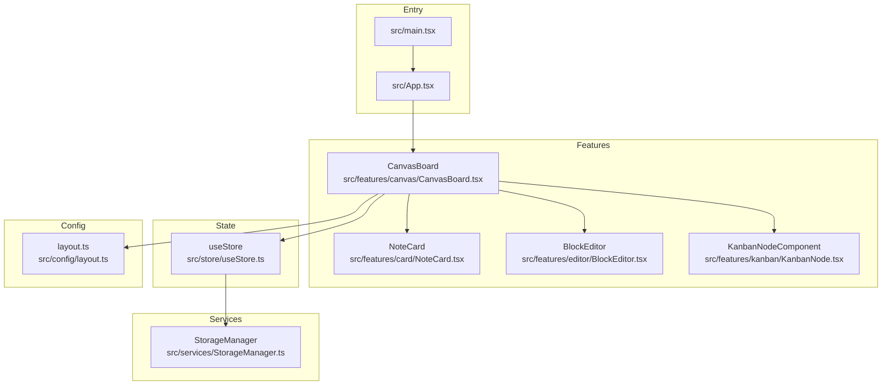
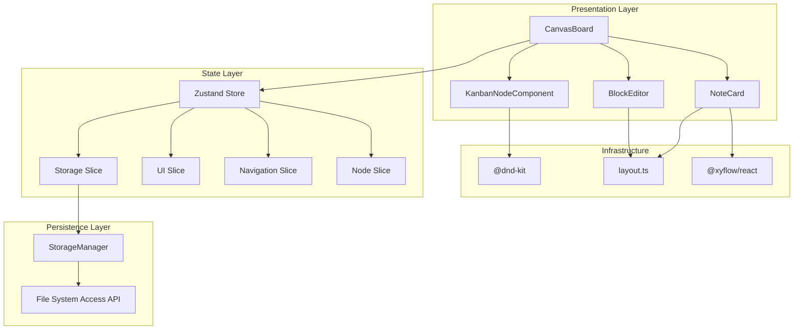
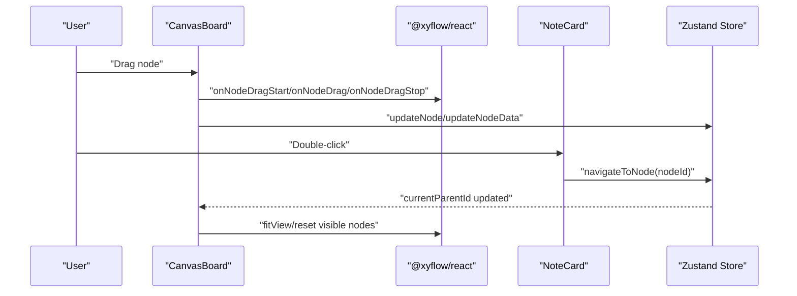
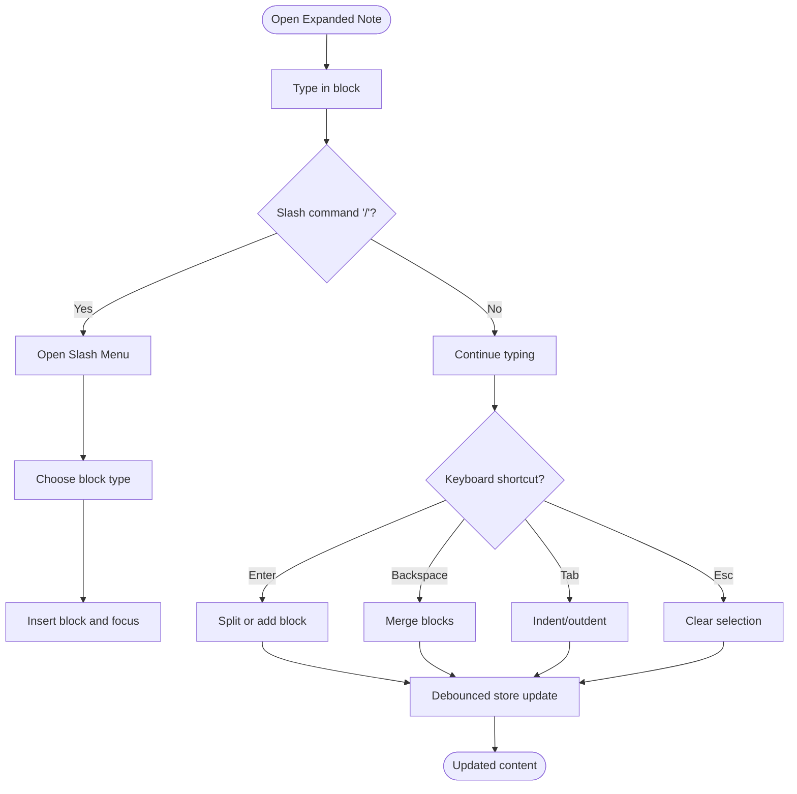
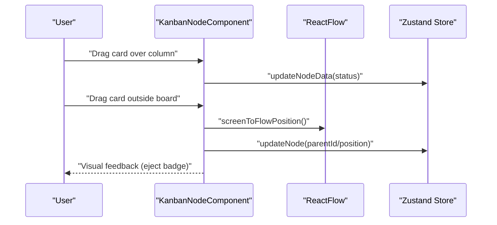
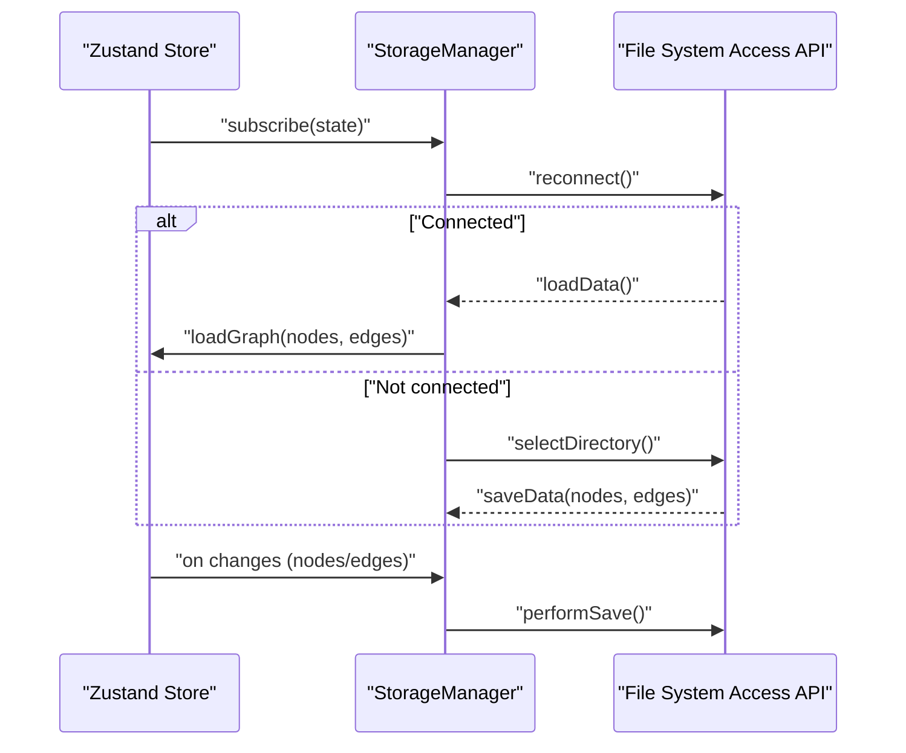
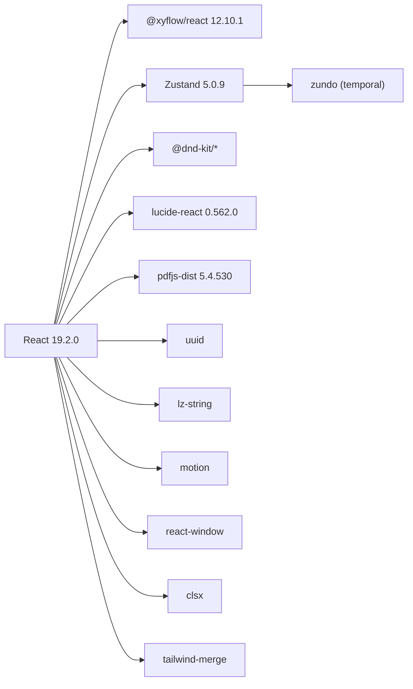

# Project Overview

<cite>
**Referenced Files in This Document**
- [README.md](file://README.md)
- [package.json](file://package.json)
- [INFORMATION_ARCHITECTURE.md](file://INFORMATION_ARCHITECTURE.md)
- [COLLABORATION.md](file://COLLABORATION.md)
- [src/App.tsx](file://src/App.tsx)
- [src/main.tsx](file://src/main.tsx)
- [src/features/canvas/CanvasBoard.tsx](file://src/features/canvas/CanvasBoard.tsx)
- [src/features/card/NoteCard.tsx](file://src/features/card/NoteCard.tsx)
- [src/features/editor/BlockEditor.tsx](file://src/features/editor/BlockEditor.tsx)
- [src/features/kanban/KanbanNode.tsx](file://src/features/kanban/KanbanNode.tsx)
- [src/config/layout.ts](file://src/config/layout.ts)
- [src/store/useStore.ts](file://src/store/useStore.ts)
- [src/types.ts](file://src/types.ts)
- [src/services/StorageManager.ts](file://src/services/StorageManager.ts)
</cite>

## Table of Contents
1. [Introduction](#introduction)
2. [Project Structure](#project-structure)
3. [Core Components](#core-components)
4. [Architecture Overview](#architecture-overview)
5. [Detailed Component Analysis](#detailed-component-analysis)
6. [Dependency Analysis](#dependency-analysis)
7. [Performance Considerations](#performance-considerations)
8. [Troubleshooting Guide](#troubleshooting-guide)
9. [Conclusion](#conclusion)
10. [Appendices](#appendices)

## Introduction
Infonote is a modern visual note-taking application designed around an infinite canvas. It enables users to organize ideas spatially, connect related thoughts, and manage tasks through an integrated kanban board. The platform emphasizes flexible, human-friendly workflows: create notes, arrange them on a canvas, embed rich content with a block-based editor, and collaborate through shared workspaces.

Key value propositions:
- Spatial organization: Arrange notes freely on an infinite canvas for intuitive mental models.
- Multi-view cards: Switch between compact, medium, expanded, and chromeless views to match context.
- Block-based editing: Compose rich content with a powerful inline editor and slash commands.
- Kanban integration: Plan and track tasks with boards, timelines, calendars, and tables.
- Collaborative workspace: Share and synchronize workspaces with peers using a simple collaboration model.

Target audience:
- Knowledge workers who think visually and benefit from spatial layouts.
- Teams needing lightweight collaboration and shared workspaces.
- Writers, researchers, and designers who need flexible, interconnected note systems.

## Project Structure
The project follows a feature-based architecture with clear separation of concerns:
- Entry points: Application bootstrap and provider wiring.
- Features: Canvas, note cards, block editor, kanban, navigation, and shared UI.
- State: Centralized with Zustand slices for nodes, navigation, UI, and storage.
- Services: File system storage integration for persistence and synchronization.
- Config: Shared layout constants and utilities for grid snapping and sizing.

**Diagram sources**
- [src/main.tsx:1-22](file://src/main.tsx#L1-L22)
- [src/App.tsx:1-16](file://src/App.tsx#L1-L16)
- [src/features/canvas/CanvasBoard.tsx:1-263](file://src/features/canvas/CanvasBoard.tsx#L1-L263)
- [src/features/card/NoteCard.tsx:1-619](file://src/features/card/NoteCard.tsx#L1-L619)
- [src/features/editor/BlockEditor.tsx:1-819](file://src/features/editor/BlockEditor.tsx#L1-L819)
- [src/features/kanban/KanbanNode.tsx:1-738](file://src/features/kanban/KanbanNode.tsx#L1-L738)
- [src/store/useStore.ts:1-53](file://src/store/useStore.ts#L1-L53)
- [src/services/StorageManager.ts:1-159](file://src/services/StorageManager.ts#L1-L159)
- [src/config/layout.ts:1-138](file://src/config/layout.ts#L1-L138)

**Section sources**
- [INFORMATION_ARCHITECTURE.md:19-50](file://INFORMATION_ARCHITECTURE.md#L19-L50)
- [src/App.tsx:1-16](file://src/App.tsx#L1-L16)
- [src/main.tsx:1-22](file://src/main.tsx#L1-L22)

## Core Components
- Infinite Canvas: Built on @xyflow/react, providing pan, zoom, grid snapping, and node/edge interactions.
- Note Cards: Rendered as nodes with multiple view modes (icon, medium, expanded, chromeless), supporting metadata, icons, covers, and resizing.
- Block Editor: Inline, slash-command-driven editor with drag-and-drop reordering, keyboard shortcuts, and rich content blocks.
- Kanban Integration: A hybrid node that hosts boards, timelines, calendars, and tables, with drag-and-drop reordering and nesting.
- State Management: Zustand-based store with slices for nodes, navigation, UI, and storage, plus temporal undo/redo.
- Storage: File System Access API-backed persistence with automatic reconnect and debounced saves.

**Section sources**
- [INFORMATION_ARCHITECTURE.md:161-282](file://INFORMATION_ARCHITECTURE.md#L161-L282)
- [src/features/canvas/CanvasBoard.tsx:98-104](file://src/features/canvas/CanvasBoard.tsx#L98-L104)
- [src/features/card/NoteCard.tsx:16-32](file://src/features/card/NoteCard.tsx#L16-L32)
- [src/features/editor/BlockEditor.tsx:24-36](file://src/features/editor/BlockEditor.tsx#L24-L36)
- [src/features/kanban/KanbanNode.tsx:47-105](file://src/features/kanban/KanbanNode.tsx#L47-L105)
- [src/store/useStore.ts:11-29](file://src/store/useStore.ts#L11-L29)
- [src/services/StorageManager.ts:19-74](file://src/services/StorageManager.ts#L19-L74)

## Architecture Overview
Infonote uses a component-based architecture with a strong separation between presentation, state, and persistence:
- Presentation: Feature components encapsulate UI and interactions (CanvasBoard, NoteCard, BlockEditor, KanbanNodeComponent).
- State: Zustand slices manage nodes, edges, navigation, UI state, and storage status with temporal history.
- Persistence: StorageManager coordinates with the File System Access API to persist graph data and auto-reconnect on load.
- Infrastructure: React Flow powers the canvas; @dnd-kit provides drag-and-drop; layout utilities enforce grid snapping and sizing.

**Diagram sources**
- [src/features/canvas/CanvasBoard.tsx:183-236](file://src/features/canvas/CanvasBoard.tsx#L183-L236)
- [src/features/card/NoteCard.tsx:16-32](file://src/features/card/NoteCard.tsx#L16-L32)
- [src/features/editor/BlockEditor.tsx:40-80](file://src/features/editor/BlockEditor.tsx#L40-L80)
- [src/features/kanban/KanbanNode.tsx:47-105](file://src/features/kanban/KanbanNode.tsx#L47-L105)
- [src/store/useStore.ts:11-29](file://src/store/useStore.ts#L11-L29)
- [src/services/StorageManager.ts:19-74](file://src/services/StorageManager.ts#L19-L74)
- [src/config/layout.ts:61-100](file://src/config/layout.ts#L61-L100)

## Detailed Component Analysis

### Canvas and Cards
The canvas orchestrates node rendering, selection, drag-and-drop, and modal overlays. Note cards adapt their view mode based on size and support metadata editing, icon selection, and cover images. The grid system ensures consistent spacing and snapping.

**Diagram sources**
- [src/features/canvas/CanvasBoard.tsx:119-129](file://src/features/canvas/CanvasBoard.tsx#L119-L129)
- [src/features/card/NoteCard.tsx:262-265](file://src/features/card/NoteCard.tsx#L262-L265)
- [src/store/useStore.ts:11-29](file://src/store/useStore.ts#L11-L29)

**Section sources**
- [src/features/canvas/CanvasBoard.tsx:183-236](file://src/features/canvas/CanvasBoard.tsx#L183-L236)
- [src/features/card/NoteCard.tsx:16-32](file://src/features/card/NoteCard.tsx#L16-L32)
- [src/config/layout.ts:61-100](file://src/config/layout.ts#L61-L100)

### Block-Based Editing
The block editor supports rich content composition with slash menus, drag-and-drop reordering, keyboard shortcuts, and selection islands. It integrates with the canvas store to update content and supports splitting nodes when content is moved.

**Diagram sources**
- [src/features/editor/BlockEditor.tsx:317-576](file://src/features/editor/BlockEditor.tsx#L317-L576)

**Section sources**
- [src/features/editor/BlockEditor.tsx:24-36](file://src/features/editor/BlockEditor.tsx#L24-L36)
- [src/features/editor/BlockEditor.tsx:40-80](file://src/features/editor/BlockEditor.tsx#L40-L80)

### Kanban Integration
Kanban boards support multiple views (board, table, calendar, timeline), filtering, sorting, swimlanes, and drag-and-drop reordering. Cards can be ejected to the canvas or nested into other nodes.

**Diagram sources**
- [src/features/kanban/KanbanNode.tsx:436-592](file://src/features/kanban/KanbanNode.tsx#L436-L592)

**Section sources**
- [src/features/kanban/KanbanNode.tsx:47-105](file://src/features/kanban/KanbanNode.tsx#L47-L105)
- [src/features/kanban/KanbanNode.tsx:694-731](file://src/features/kanban/KanbanNode.tsx#L694-L731)

### State and Persistence
Zustand slices manage nodes, edges, navigation, UI, and storage. StorageManager auto-reconnects to a persisted folder and debounces saves for performance.

**Diagram sources**
- [src/store/useStore.ts:31-52](file://src/store/useStore.ts#L31-L52)
- [src/services/StorageManager.ts:76-109](file://src/services/StorageManager.ts#L76-L109)

**Section sources**
- [src/store/useStore.ts:11-29](file://src/store/useStore.ts#L11-L29)
- [src/services/StorageManager.ts:19-74](file://src/services/StorageManager.ts#L19-L74)

## Dependency Analysis
Technology stack and key dependencies:
- Framework: React 19.2.0 + TypeScript
- Build: Vite 5.4.11
- Canvas: @xyflow/react 12.10.1
- State: Zustand 5.0.9
- Drag & Drop: @dnd-kit (core, sortable, utilities)
- Icons: lucide-react 0.562.0
- PDF: pdfjs-dist 5.4.530
- Utilities: uuid, lz-string, motion, react-window, clsx, tailwind-merge

**Diagram sources**
- [package.json:12-32](file://package.json#L12-L32)

**Section sources**
- [package.json:12-32](file://package.json#L12-L32)
- [INFORMATION_ARCHITECTURE.md:7-16](file://INFORMATION_ARCHITECTURE.md#L7-L16)

## Performance Considerations
- Grid snapping and strict sizing reduce layout thrashing and ensure consistent visuals.
- Auto-grow in expanded mode uses ResizeObserver with debouncing and micro-stability checks to prevent oscillations.
- Debounced saves in StorageManager minimize filesystem writes.
- Lazy loading of modals (e.g., KanbanConfigModal) reduces initial bundle weight.
- IntersectionObserver defers heavy features until nodes enter viewport.

[No sources needed since this section provides general guidance]

## Troubleshooting Guide
Common issues and resolutions:
- Collaboration conflicts: When multiple users edit the same file, resolve conflicts by pulling updates, opening conflicting files, choosing desired changes, and pushing again.
- Storage connection: If auto-reconnect fails, manually select a directory and ensure permissions are granted.
- Canvas responsiveness: If drag or selection feels sluggish, verify grid snapping and viewport constraints are not overly aggressive.

**Section sources**
- [COLLABORATION.md:47-54](file://COLLABORATION.md#L47-L54)
- [src/services/StorageManager.ts:76-94](file://src/services/StorageManager.ts#L76-L94)

## Conclusion
Infonote blends spatial organization with rich editing and task management into a cohesive visual workspace. Its component-based architecture, robust state management, and file-system-backed persistence provide a scalable foundation for individual creators and teams. The combination of infinite canvas, multi-view cards, block-based editing, kanban integration, and collaborative capabilities makes it a versatile tool for knowledge work.

[No sources needed since this section summarizes without analyzing specific files]

## Appendices

### Conceptual Overview for Beginners
- Spatial vs hierarchical thinking:
  - Spatial: Place related ideas near each other on the canvas to reflect relationships and proximity.
  - Hierarchical: Organize content in nested folders or outlines.
  - Infonote encourages spatial thinking with free placement, connections, and navigation breadcrumbs.

- Practical tips:
  - Start with “icon” view for quick scanning, expand as needed.
  - Use edges to connect related notes and create a living map of ideas.
  - Use kanban to plan tasks and track progress across boards and timelines.

[No sources needed since this section doesn't analyze specific files]

### Technical Details for Experienced Developers
- Component relationships:
  - CanvasBoard registers node types and delegates interactions to hooks and store selectors.
  - NoteCard renders view modes and manages metadata editing, icon selection, and cover images.
  - BlockEditor composes blocks with slash commands, drag-and-drop, and keyboard shortcuts.
  - KanbanNodeComponent integrates @dnd-kit for drag-and-drop, supports multiple views, and can eject cards to the canvas.

- Data model highlights:
  - Node types: NoteNode, BlockNode, FusedNoteNode, KanbanNode.
  - NoteData supports rich metadata (status, priority, dueDate, assignee, progress, subtasks).
  - KanbanNodeData defines columns, swimlanes, sorting, and view modes.

**Section sources**
- [src/features/canvas/CanvasBoard.tsx:98-104](file://src/features/canvas/CanvasBoard.tsx#L98-L104)
- [src/features/card/NoteCard.tsx:16-32](file://src/features/card/NoteCard.tsx#L16-L32)
- [src/features/editor/BlockEditor.tsx:24-36](file://src/features/editor/BlockEditor.tsx#L24-L36)
- [src/features/kanban/KanbanNode.tsx:47-105](file://src/features/kanban/KanbanNode.tsx#L47-L105)
- [src/types.ts:3-85](file://src/types.ts#L3-L85)

### Practical Workflows
- Creating notes:
  - Use the bottom menu to add a note in icon, medium, or expanded view.
  - Double-click to open expanded view and start editing content.
- Organizing information:
  - Drag notes to reposition; connect with edges to show relationships.
  - Navigate into a note to create a hierarchical context; breadcrumbs help you move up.
- Managing tasks:
  - Add a Kanban node, configure columns and swimlanes, and drag cards between statuses.
  - Use filters and sorting to focus on priorities and deadlines.

**Section sources**
- [INFORMATION_ARCHITECTURE.md:427-456](file://INFORMATION_ARCHITECTURE.md#L427-L456)