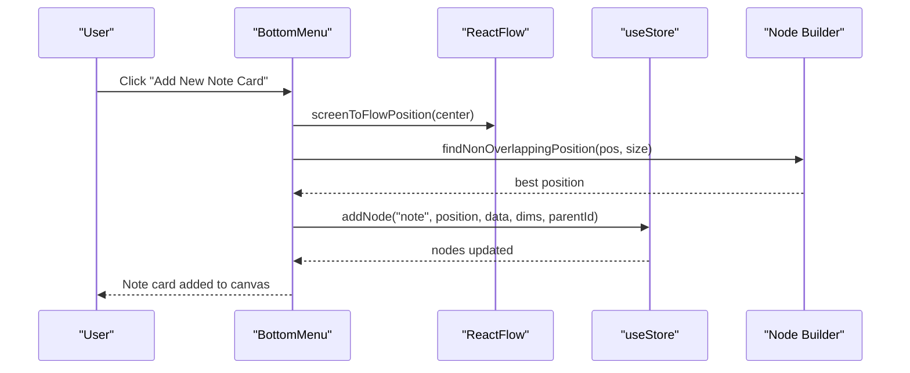
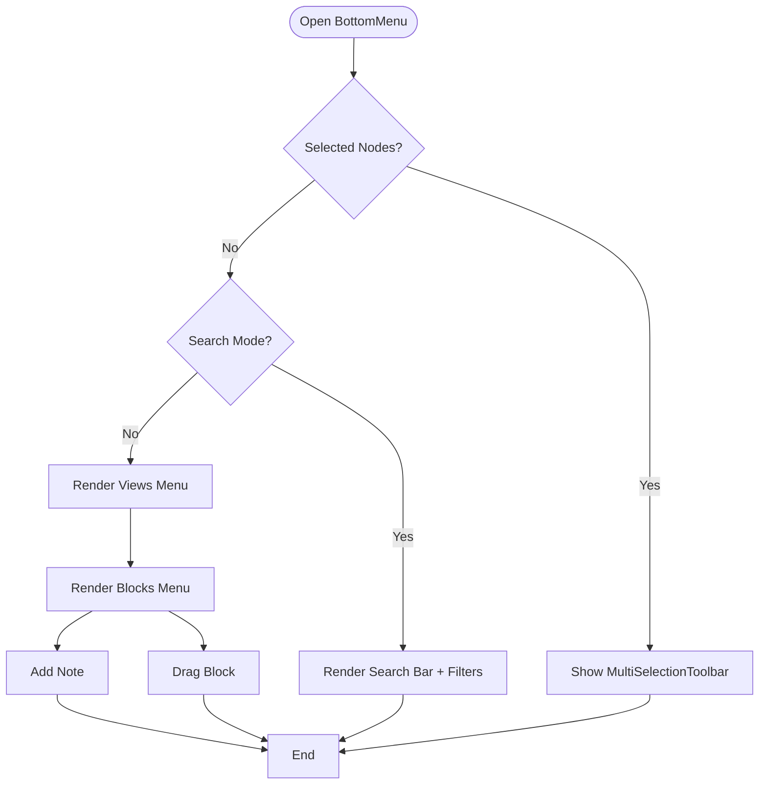
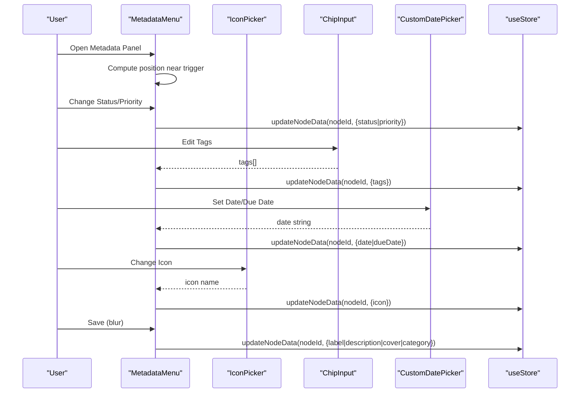
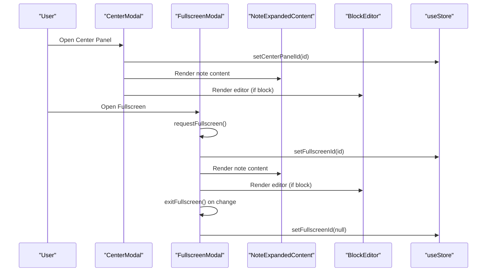
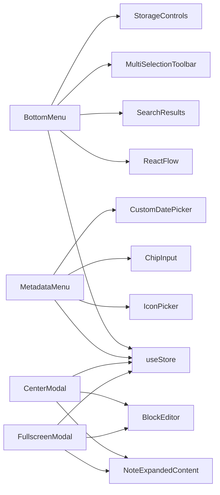

# UI Components

<cite>
**Referenced Files in This Document**
- [BottomMenu.tsx](file://src/features/ui/BottomMenu.tsx)
- [MetadataMenu.tsx](file://src/features/ui/MetadataMenu.tsx)
- [ThemeSwitcher.tsx](file://src/features/ui/ThemeSwitcher.tsx)
- [CenterModal.tsx](file://src/features/ui/CenterModal.tsx)
- [FullscreenModal.tsx](file://src/features/ui/FullscreenModal.tsx)
- [SelectionCapsule.tsx](file://src/features/editor/ui/SelectionCapsule.tsx)
- [CustomDatePicker.tsx](file://src/features/ui/CustomDatePicker.tsx)
- [ChipInput.tsx](file://src/features/ui/ChipInput.tsx)
- [PDFViewer.tsx](file://src/features/ui/PDFViewer.tsx)
- [SearchResults.tsx](file://src/features/ui/SearchResults.tsx)
- [MultiSelectionToolbar.tsx](file://src/features/ui/MultiSelectionToolbar.tsx)
- [StorageControls.tsx](file://src/features/ui/StorageControls.tsx)
- [IconPicker.tsx](file://src/features/card/IconPicker.tsx)
- [NoteExpandedContent.tsx](file://src/features/card/NoteExpandedContent.tsx)
- [BlockEditor.tsx](file://src/features/editor/BlockEditor.tsx)
- [useStore.ts](file://src/store/useStore.ts)
- [menuConstants.tsx](file://src/features/editor/menuConstants.tsx)
- [searchUtils.ts](file://src/features/ui/searchUtils.ts)
- [BottomMenu.module.css](file://src/features/ui/BottomMenu.module.css)
- [MetadataMenu.module.css](file://src/features/ui/MetadataMenu.module.css)
- [FullscreenModal.module.css](file://src/features/ui/FullscreenModal.module.css)
- [ThemeSwitcher.module.css](file://src/features/ui/ThemeSwitcher.module.css)
- [ChipInput.module.css](file://src/features/ui/ChipInput.module.css)
- [CustomDatePicker.module.css](file://src/features/ui/CustomDatePicker.module.css)
- [SelectionCapsule.module.css](file://src/features/editor/ui/SelectionCapsule.module.css)
</cite>

## Table of Contents
1. [Introduction](#introduction)
2. [Project Structure](#project-structure)
3. [Core Components](#core-components)
4. [Architecture Overview](#architecture-overview)
5. [Detailed Component Analysis](#detailed-component-analysis)
6. [Dependency Analysis](#dependency-analysis)
7. [Performance Considerations](#performance-considerations)
8. [Troubleshooting Guide](#troubleshooting-guide)
9. [Conclusion](#conclusion)
10. [Appendices](#appendices)

## Introduction
This document describes Infonote’s UI component system with a focus on shared components (bottom menus, metadata editing, theme switching, and modal overlays), as well as specialized components (selection capsules, custom date picker, chip input, and PDF viewer). It explains component responsibilities, props, events, styling, customization, composition patterns, responsiveness, accessibility, states/animations/transitions, and extension guidelines.

## Project Structure
The UI components live primarily under src/features/ui and src/features/editor/ui. They integrate with a centralized store (Zustand) for state and connect to editor and card features for content rendering.

```mermaid
graph TB
subgraph "UI Features"
BM["BottomMenu.tsx"]
MM["MetadataMenu.tsx"]
TS["ThemeSwitcher.tsx"]
CM["CenterModal.tsx"]
FM["FullscreenModal.tsx"]
CDP["CustomDatePicker.tsx"]
CI["ChipInput.tsx"]
SC["SelectionCapsule.tsx"]
PV["PDFViewer.tsx"]
SR["SearchResults.tsx"]
MST["MultiSelectionToolbar.tsx"]
ST["StorageControls.tsx"]
end
subgraph "Editor"
BE["BlockEditor.tsx"]
MC["menuConstants.tsx"]
end
subgraph "Card"
NEC["NoteExpandedContent.tsx"]
IP["IconPicker.tsx"]
end
subgraph "Store"
US["useStore.ts"]
end
BM --> US
MM --> US
TS --> US
CM --> US
FM --> US
BM --> BE
BM --> MC
MM --> IP
MM --> CDP
MM --> CI
CM --> NEC
FM --> NEC
CM --> BE
FM --> BE
BM --> ST
BM --> MST
BM --> SR
```

**Diagram sources**
- [BottomMenu.tsx](file://src/features/ui/BottomMenu.tsx)
- [MetadataMenu.tsx](file://src/features/ui/MetadataMenu.tsx)
- [ThemeSwitcher.tsx](file://src/features/ui/ThemeSwitcher.tsx)
- [CenterModal.tsx](file://src/features/ui/CenterModal.tsx)
- [FullscreenModal.tsx](file://src/features/ui/FullscreenModal.tsx)
- [CustomDatePicker.tsx](file://src/features/ui/CustomDatePicker.tsx)
- [ChipInput.tsx](file://src/features/ui/ChipInput.tsx)
- [SelectionCapsule.tsx](file://src/features/editor/ui/SelectionCapsule.tsx)
- [PDFViewer.tsx](file://src/features/ui/PDFViewer.tsx)
- [SearchResults.tsx](file://src/features/ui/SearchResults.tsx)
- [MultiSelectionToolbar.tsx](file://src/features/ui/MultiSelectionToolbar.tsx)
- [StorageControls.tsx](file://src/features/ui/StorageControls.tsx)
- [BlockEditor.tsx](file://src/features/editor/BlockEditor.tsx)
- [menuConstants.tsx](file://src/features/editor/menuConstants.tsx)
- [NoteExpandedContent.tsx](file://src/features/card/NoteExpandedContent.tsx)
- [IconPicker.tsx](file://src/features/card/IconPicker.tsx)
- [useStore.ts](file://src/store/useStore.ts)

**Section sources**
- [BottomMenu.tsx](file://src/features/ui/BottomMenu.tsx)
- [useStore.ts](file://src/store/useStore.ts)

## Core Components
- BottomMenu: A floating toolbar offering search, add note, views, and block insertion. Integrates with the store for node creation and updates, and with React Flow for positioning.
- MetadataMenu: An inline settings panel for note metadata (title, description, icon, cover, tags, status, priority, dates). Uses portals for positioning and integrates with IconPicker, ChipInput, and CustomDatePicker.
- ThemeSwitcher: A simple toggle that switches between light/dark themes via the store.
- CenterModal and FullscreenModal: Overlay modals hosting either NoteExpandedContent or BlockEditor, with drag-and-drop prevention on overlay surfaces.
- Specialized Inputs: ChipInput, CustomDatePicker, SelectionCapsule, and PDFViewer provide reusable editing and presentation capabilities.

**Section sources**
- [BottomMenu.tsx](file://src/features/ui/BottomMenu.tsx)
- [MetadataMenu.tsx](file://src/features/ui/MetadataMenu.tsx)
- [ThemeSwitcher.tsx](file://src/features/ui/ThemeSwitcher.tsx)
- [CenterModal.tsx](file://src/features/ui/CenterModal.tsx)
- [FullscreenModal.tsx](file://src/features/ui/FullscreenModal.tsx)
- [ChipInput.tsx](file://src/features/ui/ChipInput.tsx)
- [CustomDatePicker.tsx](file://src/features/ui/CustomDatePicker.tsx)
- [SelectionCapsule.tsx](file://src/features/editor/ui/SelectionCapsule.tsx)
- [PDFViewer.tsx](file://src/features/ui/PDFViewer.tsx)

## Architecture Overview
The UI components rely on a central store for state (nodes, active panels, theme). BottomMenu orchestrates node creation and updates, while modals host content editors. MetadataMenu composes smaller components (IconPicker, ChipInput, CustomDatePicker) to edit note metadata. Styling is modular via CSS Modules.

**Diagram sources**
- [BottomMenu.tsx](file://src/features/ui/BottomMenu.tsx)
- [useStore.ts](file://src/store/useStore.ts)

## Detailed Component Analysis

### BottomMenu
Responsibilities:
- Toggle search mode and render SearchResults.
- Manage filter chips for tags/status/priority/type/date ranges.
- Provide “Add Note” and “Add View” actions.
- Insert blocks via drag-and-drop or click into the active context (selected node, center/fullscreen modal, or canvas).
- Position new nodes to avoid overlap using a radial search algorithm.

Key props/events:
- None (self-contained). Interacts with store selectors and React Flow.

States and behavior:
- Search mode toggles visibility of search bar and filters.
- Filters are applied by reconstructing a query string and passing it to SearchResults.
- Non-overlapping position computed using padding/step/radius checks with fallbacks.

Accessibility:
- Buttons include titles and aria labels via title attributes.

Styling:
- Modular CSS via BottomMenu.module.css.

Composition patterns:
- Delegates to MultiSelectionToolbar when nodes are selected.
- Uses StorageControls for storage-related actions.
- Integrates SearchResults and menu constants for block insertion.

**Diagram sources**
- [BottomMenu.tsx](file://src/features/ui/BottomMenu.tsx)
- [MultiSelectionToolbar.tsx](file://src/features/ui/MultiSelectionToolbar.tsx)
- [StorageControls.tsx](file://src/features/ui/StorageControls.tsx)
- [SearchResults.tsx](file://src/features/ui/SearchResults.tsx)
- [menuConstants.tsx](file://src/features/editor/menuConstants.tsx)

**Section sources**
- [BottomMenu.tsx](file://src/features/ui/BottomMenu.tsx)
- [menuConstants.tsx](file://src/features/editor/menuConstants.tsx)
- [searchUtils.ts](file://src/features/ui/searchUtils.ts)
- [BottomMenu.module.css](file://src/features/ui/BottomMenu.module.css)

### MetadataMenu
Responsibilities:
- Inline settings panel for a note node.
- Supports editing label, description, icon, cover image, category, tags, status, priority, and dates.
- Uses portals to render a positioned panel near the trigger button.
- Integrates IconPicker, ChipInput, CustomSelect, and CustomDatePicker.

Props:
- nodeId: string (required)

Events:
- None (updates via store callbacks).

States and behavior:
- Tracks local editedData synchronized from node.data.
- Calculates panel position to avoid viewport overflow.
- Handles click-outside to close.
- Saves immediately for select/chip inputs; saves on blur for text inputs.

Accessibility:
- Uses semantic labels and buttons with titles.

Styling:
- MetadataMenu.module.css defines layout and portal positioning.

**Diagram sources**
- [MetadataMenu.tsx](file://src/features/ui/MetadataMenu.tsx)
- [IconPicker.tsx](file://src/features/card/IconPicker.tsx)
- [ChipInput.tsx](file://src/features/ui/ChipInput.tsx)
- [CustomDatePicker.tsx](file://src/features/ui/CustomDatePicker.tsx)
- [useStore.ts](file://src/store/useStore.ts)

**Section sources**
- [MetadataMenu.tsx](file://src/features/ui/MetadataMenu.tsx)
- [MetadataMenu.module.css](file://src/features/ui/MetadataMenu.module.css)

### ThemeSwitcher
Responsibilities:
- Toggle between light and dark themes.
- Reflect current theme visually.

Props:
- None

Events:
- onClick triggers store toggle.

Accessibility:
- aria-label indicates current action.

Styling:
- ThemeSwitcher.module.css controls layout and icon sizing.

**Section sources**
- [ThemeSwitcher.tsx](file://src/features/ui/ThemeSwitcher.tsx)
- [ThemeSwitcher.module.css](file://src/features/ui/ThemeSwitcher.module.css)

### CenterModal and FullscreenModal
Responsibilities:
- Render overlays for expanded note content or block editing.
- Prevent overlay drops from bubbling to underlying canvas.
- Synchronize with native fullscreen when applicable.

Props:
- None (subscribe to store for active node id).

Behavior:
- CenterModal hosts NoteExpandedContent or BlockEditor depending on node type.
- FullscreenModal requests native fullscreen and listens to fullscreen change events to keep state in sync.

Accessibility:
- Escape behavior relies on fullscreen change detection.

Styling:
- FullscreenModal.module.css defines overlay and modal containers.

**Diagram sources**
- [CenterModal.tsx](file://src/features/ui/CenterModal.tsx)
- [FullscreenModal.tsx](file://src/features/ui/FullscreenModal.tsx)
- [NoteExpandedContent.tsx](file://src/features/card/NoteExpandedContent.tsx)
- [BlockEditor.tsx](file://src/features/editor/BlockEditor.tsx)
- [useStore.ts](file://src/store/useStore.ts)

**Section sources**
- [CenterModal.tsx](file://src/features/ui/CenterModal.tsx)
- [FullscreenModal.tsx](file://src/features/ui/FullscreenModal.tsx)
- [FullscreenModal.module.css](file://src/features/ui/FullscreenModal.module.css)

### SelectionCapsule
Responsibilities:
- Display contextual selection actions or suggestions.
- Provide compact, actionable UI for quick edits or commands.

Props:
- Depends on editor context; integrates with floating toolbar and slash commands.

Styling:
- SelectionCapsule.module.css provides capsule-specific layout.

**Section sources**
- [SelectionCapsule.tsx](file://src/features/editor/ui/SelectionCapsule.tsx)
- [SelectionCapsule.module.css](file://src/features/editor/ui/SelectionCapsule.module.css)

### CustomDatePicker
Responsibilities:
- Provide a localized date picker for setting date and dueDate.
- Accepts value and onChange callbacks.

Props:
- value: string (ISO date)
- onChange: (date: string) => void
- placeholder: string

Styling:
- CustomDatePicker.module.css defines input and calendar layout.

**Section sources**
- [CustomDatePicker.tsx](file://src/features/ui/CustomDatePicker.tsx)
- [CustomDatePicker.module.css](file://src/features/ui/CustomDatePicker.module.css)

### ChipInput
Responsibilities:
- Allow adding/removing tags as chips with keyboard support.
- Emit updates on change.

Props:
- value: string[]
- onChange: (tags: string[]) => void

Styling:
- ChipInput.module.css styles chips and input area.

**Section sources**
- [ChipInput.tsx](file://src/features/ui/ChipInput.tsx)
- [ChipInput.module.css](file://src/features/ui/ChipInput.module.css)

### PDFViewer
Responsibilities:
- Render PDF content for preview or annotation scenarios.
- Provide zoom/scroll controls and page navigation.

Props:
- src: string (URL or blob)
- onLoad: () => void
- onError: (error: any) => void

Styling:
- PDFViewer styles are defined alongside component logic.

**Section sources**
- [PDFViewer.tsx](file://src/features/ui/PDFViewer.tsx)

## Dependency Analysis
- BottomMenu depends on:
  - Store for node operations and selection.
  - React Flow for coordinate conversion.
  - SearchResults for query parsing and filtering.
  - MultiSelectionToolbar for multi-select context.
  - StorageControls for storage actions.
- MetadataMenu depends on:
  - Store for node updates.
  - IconPicker, ChipInput, CustomSelect, CustomDatePicker for editing.
  - Portal rendering for positioning.
- Modals depend on:
  - Store for active panel ids.
  - Fullscreen API for FullscreenModal.
  - Content components (NoteExpandedContent, BlockEditor) for rendering.

**Diagram sources**
- [BottomMenu.tsx](file://src/features/ui/BottomMenu.tsx)
- [MetadataMenu.tsx](file://src/features/ui/MetadataMenu.tsx)
- [CenterModal.tsx](file://src/features/ui/CenterModal.tsx)
- [FullscreenModal.tsx](file://src/features/ui/FullscreenModal.tsx)
- [useStore.ts](file://src/store/useStore.ts)

**Section sources**
- [BottomMenu.tsx](file://src/features/ui/BottomMenu.tsx)
- [MetadataMenu.tsx](file://src/features/ui/MetadataMenu.tsx)
- [CenterModal.tsx](file://src/features/ui/CenterModal.tsx)
- [FullscreenModal.tsx](file://src/features/ui/FullscreenModal.tsx)
- [useStore.ts](file://src/store/useStore.ts)

## Performance Considerations
- Avoid unnecessary re-renders by subscribing to minimal slices of state (e.g., CenterModal and FullscreenModal subscribe only to the active node id).
- Compose components to minimize DOM depth and heavy computations (e.g., BottomMenu computes non-overlapping positions once per insertion).
- Use CSS Modules to scope styles and reduce cascade costs.
- Debounce or batch frequent updates (e.g., immediate saves for selects/chips in MetadataMenu).

## Troubleshooting Guide
- Modals not closing:
  - Ensure store setters are called and fullscreen change listeners are attached for FullscreenModal.
- Overlapping nodes:
  - Verify findNonOverlappingPosition logic and node dimensions passed to addNode.
- Metadata not saving:
  - Confirm onBlur handlers for text inputs and immediate updates for selects/chips.
- Portal positioning issues:
  - Check useLayoutEffect calculations and viewport boundaries in MetadataMenu.

**Section sources**
- [CenterModal.tsx](file://src/features/ui/CenterModal.tsx)
- [FullscreenModal.tsx](file://src/features/ui/FullscreenModal.tsx)
- [MetadataMenu.tsx](file://src/features/ui/MetadataMenu.tsx)
- [BottomMenu.tsx](file://src/features/ui/BottomMenu.tsx)

## Conclusion
Infonote’s UI component system emphasizes composability, centralized state, and modular styling. Shared components like BottomMenu, MetadataMenu, ThemeSwitcher, and modals provide consistent interaction patterns, while specialized components enable rich editing experiences. Following the established patterns ensures predictable behavior, accessibility, and maintainability.

## Appendices

### Props and Events Reference

- BottomMenu
  - Props: none
  - Events: internal state changes; integrates with store and React Flow

- MetadataMenu
  - Props: nodeId: string
  - Events: internal state changes; emits updates via store

- ThemeSwitcher
  - Props: none
  - Events: onClick → toggle theme

- CenterModal
  - Props: none
  - Events: onClose callback; navigates on demand

- FullscreenModal
  - Props: none
  - Events: onClose callback; handles fullscreen lifecycle

- SelectionCapsule
  - Props: context-dependent (editor integration)
  - Events: context-driven actions

- CustomDatePicker
  - Props: value: string, onChange: (date: string) => void, placeholder: string

- ChipInput
  - Props: value: string[], onChange: (tags: string[]) => void

- PDFViewer
  - Props: src: string, onLoad: () => void, onError: (error: any) => void

### Accessibility Checklist
- Buttons include titles and aria-labels where relevant.
- Focus states visible for interactive elements.
- Keyboard navigation supported for modals and dropdowns.
- Sufficient color contrast for theme modes.

### Extension Guidelines
- Keep state subscriptions minimal; derive derived data via memoization.
- Prefer composition over duplication; reuse ChipInput, CustomDatePicker, IconPicker.
- Use portals for context-aware overlays; compute positions to avoid overflow.
- Maintain CSS Modules scoping; avoid global style overrides.
- Add tests for complex flows (e.g., fullscreen transitions, search filters).